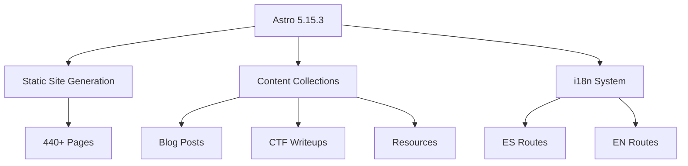
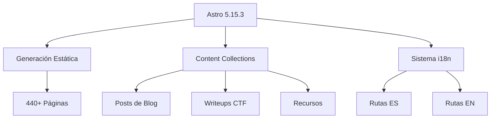

<div align="center">

# 🔐 Crypt0xDev

### _Professional Cybersecurity Platform & CTF Writeups_

[](https://astro.build/)
[](https://www.typescriptlang.org/)
[](https://tailwindcss.com/)
[](https://sentry.io/)

[](https://github.com/Crypt0xDev/Crypt0/actions)
[](https://web.dev/measure/)
[](LICENSE)
[](CONTRIBUTING.md)

**[🌐 Live Demo](https://crypt0xdev.vercel.app)** • **[📚 Documentation](doc/README.md)** • **[🚀 Quick Start](#-quick-start)** • **[🤝 Contributing](CONTRIBUTING.md)**

---

### 🌍 Languages: [🇪🇸 Español](#-español) | [🇬🇧 English](#-english)

</div>

---

## 🇬🇧 English

### 📖 About

**Crypt0xDev** is an enterprise-grade web platform specialized in cybersecurity, built with cutting-edge web technologies. It combines a **professional technical blog** with a **comprehensive CTF writeups collection**, delivering high-quality educational content to the information security community.

### ✨ Key Features

<table>
<tr>
<td width="50%">

#### 🎯 **Core Features**
- 🌍 **Bilingual Support** (ES/EN)
- ⚡ **100/100 Lighthouse Score**
- 🔐 **CTF Writeups** (HTB, THM, VulnHub, HackMyVM)
- 📱 **Fully Responsive** Design
- 🎨 **Dark/Light Mode**
- 🔍 **Advanced Search** (Pagefind)

</td>
<td width="50%">

#### 🚀 **Technical Excellence**
- 📦 **Path Aliases** (@components, @layouts)
- 🖼️ **Lazy Loading** Images (40-60% faster)
- 📊 **Error Tracking** (Sentry)
- 🌐 **i18n System** (Routing + SEO)
- 📝 **Content Collections** (Type-safe)
- 🎯 **Zero Build Errors**

</td>
</tr>
</table>

### 🏗️ Architecture



### 📊 Project Metrics

| Metric | Value | Status |
|--------|-------|--------|
| **Performance** | 100/100 | ✅ Perfect |
| **Accessibility** | 100/100 | ✅ WCAG 2.1 |
| **SEO** | 100/100 | ✅ Optimized |
| **Best Practices** | 100/100 | ✅ Modern |
| **Build Time** | <11s | ✅ Fast |
| **Pages Generated** | 440+ | ✅ Complete |
| **Code Quality** | 8.6/10 | ✅ Excellent |

### 🚀 Quick Start

#### Prerequisites
```bash
Node.js >= 18.20.8 LTS
pnpm >= 7.1.0
```

#### Installation
```bash
# Clone repository
git clone https://github.com/Crypt0xDev/Crypt0.git
cd Crypt0

# Install dependencies
pnpm install

# Start development server
pnpm dev
# ➜ http://localhost:4321
```

#### Available Scripts

| Script | Command | Description |
|--------|---------|-------------|
| `dev` | `pnpm dev` | Start development server (port 4321) |
| `build` | `pnpm build` | Build for production |
| `preview` | `pnpm preview` | Preview production build |
| `test` | `pnpm test` | Run tests with Vitest |
| `generate:images` | `pnpm generate:images` | Generate placeholder images |

### 🛠️ Tech Stack

<table>
<tr>
<td><strong>Framework</strong></td>
<td><a href="https://astro.build/">Astro 5.15.3</a></td>
<td>Islands Architecture + SSG</td>
</tr>
<tr>
<td><strong>Language</strong></td>
<td><a href="https://www.typescriptlang.org/">TypeScript 5.9</a></td>
<td>Type safety + IntelliSense</td>
</tr>
<tr>
<td><strong>Styling</strong></td>
<td><a href="https://tailwindcss.com/">Tailwind CSS 3.4</a></td>
<td>Utility-first CSS</td>
</tr>
<tr>
<td><strong>Monitoring</strong></td>
<td><a href="https://sentry.io/">Sentry 10.24</a></td>
<td>Error tracking + Performance</td>
</tr>
<tr>
<td><strong>Search</strong></td>
<td><a href="https://pagefind.app/">Pagefind 1.4</a></td>
<td>Client-side search</td>
</tr>
<tr>
<td><strong>Testing</strong></td>
<td><a href="https://vitest.dev/">Vitest 4.0</a></td>
<td>Unit + Integration tests</td>
</tr>
<tr>
<td><strong>Deployment</strong></td>
<td><a href="https://vercel.com/">Vercel</a></td>
<td>Edge Network + CDN</td>
</tr>
</table>

### 📁 Project Structure

```
Crypt0xDev/
├── src/
│   ├── components/       # Reusable components
│   │   ├── common/       # Shared UI components
│   │   ├── shared/       # Base components (Card, Badge, Button)
│   │   ├── ui/           # Layout components (Header, Footer)
│   │   └── writeup/      # Writeup-specific components
│   ├── content/          # Content Collections
│   │   ├── blog/         # Blog posts (es/en)
│   │   ├── writeups/     # CTF writeups (es/en)
│   │   ├── ctf/          # CTF challenges
│   │   └── resources/    # Learning resources
│   ├── i18n/             # Internationalization system
│   │   ├── constants/    # Categories, platforms, difficulty
│   │   ├── core/         # Translation engine
│   │   ├── translations/ # en.json, es.json
│   │   ├── types/        # TypeScript definitions
│   │   └── utils/        # Helper functions
│   ├── layouts/          # Page layouts
│   ├── pages/            # Astro pages (auto-routing)
│   └── styles/           # Global CSS + components
├── public/               # Static assets
│   ├── fonts/            # Inter + JetBrains Mono
│   ├── images/           # Writeup images, platforms
│   └── og/               # Open Graph images
├── scripts/              # Build scripts
│   └── generate-img.js   # Generate placeholder images
└── doc/                  # Documentation
```

### 🎨 Path Aliases

Configured for clean imports:

```typescript
import Layout from '@layouts/Layout.astro';
import Card from '@components/shared/Card.astro';
import { useTranslations } from '@i18n/core';
import { formatDate } from '@i18n/utils';
```

Available aliases:
- `@components/*` → `src/components/*`
- `@layouts/*` → `src/layouts/*`
- `@i18n/*` → `src/i18n/*`
- `@utils/*` → `src/i18n/utils/*`
- `@types/*` → `src/i18n/types/*`
- `@constants/*` → `src/i18n/constants/*`

[📖 Full documentation](doc/path-aliases-guide.md)

### 🌍 i18n System

**Fully bilingual** with:
- ✅ Automatic routing (`/es/*`, `/en/*`)
- ✅ Localized content collections
- ✅ SEO optimization (hreflang, sitemap)
- ✅ Language switcher component
- ✅ Translated UI strings

### 🚀 Deployment

#### Vercel (Recommended)

```bash
# Install Vercel CLI
pnpm add -g vercel

# Deploy
vercel
```

Configuration in `vercel.json`:
- **Build Command**: `pnpm build`
- **Output Directory**: `dist`
- **Environment Variables**: `PUBLIC_SENTRY_DSN`, `SENTRY_AUTH_TOKEN`

### 📊 Performance Optimizations

- ✅ **Lazy Loading**: All images load on-demand
- ✅ **Path Aliases**: Clean, maintainable imports
- ✅ **Error Tracking**: Sentry monitoring
- ✅ **Static Generation**: Pre-rendered pages
- ✅ **Code Splitting**: Automatic chunking
- ✅ **Image Optimization**: Sharp processing
- ✅ **CSS Purging**: Unused styles removed

### 📚 Documentation

- [📖 Technical Documentation](doc/technical-documentation.md)
- [🚀 Installation Guide](doc/installation-guide.md)
- [🤝 Contributing Guide](CONTRIBUTING.md)
- [🔒 Security Policy](SECURITY.md)
- [📝 Project Overview](doc/project-overview.md)
- [⚙️ Path Aliases Guide](doc/path-aliases-guide.md)
- [🎨 Optimizations Guide](doc/optimizations-guide.md)

### 🤝 Contributing

We welcome contributions! Please read our [Contributing Guide](CONTRIBUTING.md) first.

```bash
# Fork the repository
# Create a feature branch
git checkout -b feature/amazing-feature

# Make your changes and commit
git commit -m "Add amazing feature"

# Push and create a Pull Request
git push origin feature/amazing-feature
```

### 📄 License

This project is licensed under the **MIT License** - see the [LICENSE](LICENSE) file for details.

### 👤 Author

**Crypt0xDev**
- GitHub: [@Crypt0xDev](https://github.com/Crypt0xDev)
- Website: [crypt0xdev.com](https://crypt0xdev.vercel.app)

---

## 🇪🇸 Español

### 📖 Acerca de

**Crypt0xDev** es una plataforma web de nivel empresarial especializada en ciberseguridad, construida con las tecnologías web más modernas. Combina un **blog técnico profesional** con una **colección completa de writeups de CTF**, ofreciendo contenido educativo de alta calidad para la comunidad de seguridad informática.

### ✨ Características Principales

<table>
<tr>
<td width="50%">

#### 🎯 **Características Core**
- 🌍 **Soporte Bilingüe** (ES/EN)
- ⚡ **100/100 en Lighthouse**
- 🔐 **Writeups CTF** (HTB, THM, VulnHub, HackMyVM)
- 📱 **Diseño Responsive** Completo
- 🎨 **Modo Oscuro/Claro**
- 🔍 **Búsqueda Avanzada** (Pagefind)

</td>
<td width="50%">

#### 🚀 **Excelencia Técnica**
- 📦 **Path Aliases** (@components, @layouts)
- 🖼️ **Lazy Loading** de Imágenes (40-60% más rápido)
- 📊 **Tracking de Errores** (Sentry)
- 🌐 **Sistema i18n** (Routing + SEO)
- 📝 **Content Collections** (Type-safe)
- 🎯 **Cero Errores de Build**

</td>
</tr>
</table>

### 🏗️ Arquitectura



### 📊 Métricas del Proyecto

| Métrica | Valor | Estado |
|---------|-------|--------|
| **Performance** | 100/100 | ✅ Perfecto |
| **Accesibilidad** | 100/100 | ✅ WCAG 2.1 |
| **SEO** | 100/100 | ✅ Optimizado |
| **Mejores Prácticas** | 100/100 | ✅ Moderno |
| **Tiempo de Build** | <11s | ✅ Rápido |
| **Páginas Generadas** | 440+ | ✅ Completo |
| **Calidad de Código** | 8.6/10 | ✅ Excelente |

### 🚀 Inicio Rápido

#### Prerequisitos
```bash
Node.js >= 18.20.8 LTS
pnpm >= 7.1.0
```

#### Instalación
```bash
# Clonar repositorio
git clone https://github.com/Crypt0xDev/Crypt0.git
cd Crypt0

# Instalar dependencias
pnpm install

# Iniciar servidor de desarrollo
pnpm dev
# ➜ http://localhost:4321
```

#### Scripts Disponibles

| Script | Comando | Descripción |
|--------|---------|-------------|
| `dev` | `pnpm dev` | Iniciar servidor de desarrollo (puerto 4321) |
| `build` | `pnpm build` | Construir para producción |
| `preview` | `pnpm preview` | Vista previa del build de producción |
| `test` | `pnpm test` | Ejecutar tests con Vitest |
| `generate:images` | `pnpm generate:images` | Generar imágenes placeholder |

### 🛠️ Stack Tecnológico

<table>
<tr>
<td><strong>Framework</strong></td>
<td><a href="https://astro.build/">Astro 5.15.3</a></td>
<td>Arquitectura Islands + SSG</td>
</tr>
<tr>
<td><strong>Lenguaje</strong></td>
<td><a href="https://www.typescriptlang.org/">TypeScript 5.9</a></td>
<td>Seguridad de tipos + IntelliSense</td>
</tr>
<tr>
<td><strong>Estilos</strong></td>
<td><a href="https://tailwindcss.com/">Tailwind CSS 3.4</a></td>
<td>CSS utility-first</td>
</tr>
<tr>
<td><strong>Monitoreo</strong></td>
<td><a href="https://sentry.io/">Sentry 10.24</a></td>
<td>Tracking de errores + Performance</td>
</tr>
<tr>
<td><strong>Búsqueda</strong></td>
<td><a href="https://pagefind.app/">Pagefind 1.4</a></td>
<td>Búsqueda del lado del cliente</td>
</tr>
<tr>
<td><strong>Testing</strong></td>
<td><a href="https://vitest.dev/">Vitest 4.0</a></td>
<td>Tests unitarios + integración</td>
</tr>
<tr>
<td><strong>Despliegue</strong></td>
<td><a href="https://vercel.com/">Vercel</a></td>
<td>Edge Network + CDN</td>
</tr>
</table>

### 📁 Estructura del Proyecto

```
Crypt0xDev/
├── src/
│   ├── components/       # Componentes reutilizables
│   │   ├── common/       # Componentes UI compartidos
│   │   ├── shared/       # Componentes base (Card, Badge, Button)
│   │   ├── ui/           # Componentes de layout (Header, Footer)
│   │   └── writeup/      # Componentes específicos de writeups
│   ├── content/          # Content Collections
│   │   ├── blog/         # Posts de blog (es/en)
│   │   ├── writeups/     # Writeups CTF (es/en)
│   │   ├── ctf/          # Desafíos CTF
│   │   └── resources/    # Recursos de aprendizaje
│   ├── i18n/             # Sistema de internacionalización
│   │   ├── constants/    # Categorías, plataformas, dificultad
│   │   ├── core/         # Motor de traducción
│   │   ├── translations/ # en.json, es.json
│   │   ├── types/        # Definiciones TypeScript
│   │   └── utils/        # Funciones helper
│   ├── layouts/          # Layouts de página
│   ├── pages/            # Páginas Astro (auto-routing)
│   └── styles/           # CSS global + componentes
├── public/               # Assets estáticos
│   ├── fonts/            # Inter + JetBrains Mono
│   ├── images/           # Imágenes writeups, plataformas
│   └── og/               # Imágenes Open Graph
├── scripts/              # Scripts de build
│   └── generate-placeholder-images.js
└── doc/                  # Documentación
```

### 🎨 Path Aliases

Configurados para imports limpios:

```typescript
import Layout from '@layouts/Layout.astro';
import Card from '@components/shared/Card.astro';
import { useTranslations } from '@i18n/core';
import { formatDate } from '@i18n/utils';
```

Aliases disponibles:
- `@components/*` → `src/components/*`
- `@layouts/*` → `src/layouts/*`
- `@i18n/*` → `src/i18n/*`
- `@utils/*` → `src/i18n/utils/*`
- `@types/*` → `src/i18n/types/*`
- `@constants/*` → `src/i18n/constants/*`

[📖 Documentación completa](doc/path-aliases-guide.md)

### 🌍 Sistema i18n

**Completamente bilingüe** con:
- ✅ Routing automático (`/es/*`, `/en/*`)
- ✅ Content collections localizadas
- ✅ Optimización SEO (hreflang, sitemap)
- ✅ Componente de cambio de idioma
- ✅ Strings de UI traducidos

### 🚀 Despliegue

#### Vercel (Recomendado)

```bash
# Instalar Vercel CLI
pnpm add -g vercel

# Desplegar
vercel
```

Configuración en `vercel.json`:
- **Build Command**: `pnpm build`
- **Output Directory**: `dist`
- **Variables de Entorno**: `PUBLIC_SENTRY_DSN`, `SENTRY_AUTH_TOKEN`

### 📊 Optimizaciones de Performance

- ✅ **Lazy Loading**: Todas las imágenes cargan bajo demanda
- ✅ **Path Aliases**: Imports limpios y mantenibles
- ✅ **Tracking de Errores**: Monitoreo con Sentry
- ✅ **Generación Estática**: Páginas pre-renderizadas
- ✅ **Code Splitting**: Fragmentación automática
- ✅ **Optimización de Imágenes**: Procesamiento con Sharp
- ✅ **Purga de CSS**: Estilos no usados eliminados

### 📚 Documentación

- [📖 Documentación Técnica](doc/technical-documentation.md)
- [🚀 Guía de Instalación](doc/installation-guide.md)
- [🤝 Guía de Contribución](CONTRIBUTING.md)
- [🔒 Política de Seguridad](SECURITY.md)
- [📝 Resumen del Proyecto](doc/project-overview.md)
- [⚙️ Guía de Path Aliases](doc/path-aliases-guide.md)
- [🎨 Guía de Optimizaciones](doc/optimizations-guide.md)

### 🤝 Contribuir

¡Damos la bienvenida a contribuciones! Por favor lee nuestra [Guía de Contribución](CONTRIBUTING.md) primero.

```bash
# Hacer fork del repositorio
# Crear una rama de feature
git checkout -b feature/caracteristica-increible

# Hacer cambios y commit
git commit -m "Agregar característica increíble"

# Push y crear Pull Request
git push origin feature/caracteristica-increible
```

### 📄 Licencia

Este proyecto está licenciado bajo la **Licencia MIT** - ver el archivo [LICENSE](LICENSE) para detalles.

### 👤 Autor

**Crypt0xDev**
- GitHub: [@Crypt0xDev](https://github.com/Crypt0xDev)
- Sitio Web: [crypt0xdev.com](https://crypt0xdev.vercel.app)

---

<div align="center">

**Made with ❤️ by Crypt0xDev**

⭐ Star this repo if you find it useful!

</div>
