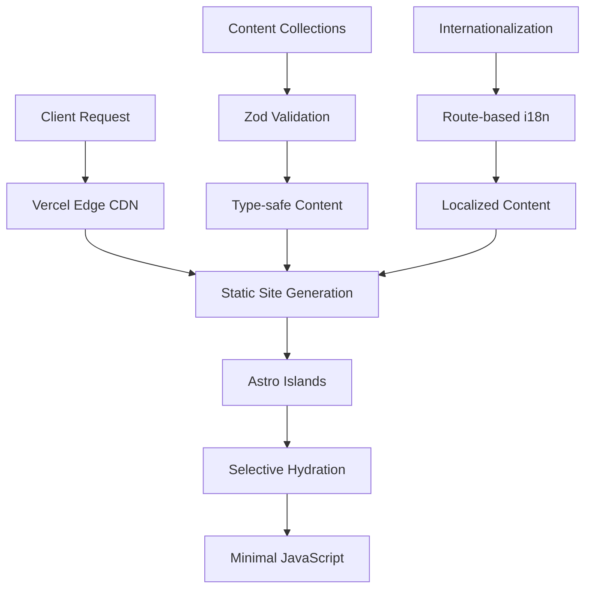

<div align="center">

# 🔐 **Crypt0xDev**

### _Plataforma Profesional de Ciberseguridad & CTF Writeups_

[](https://astro.build/)
[](https://www.typescriptlang.org/)
[](https://tailwindcss.com/)
[](https://vercel.com/)

[](https://github.com/Crypt0xDev/Crypt0/actions)
[](https://web.dev/measure/)
[](LICENSE)
[](CONTRIBUTING.md)

**🚀 [Demo en Vivo](https://crypt0xdev.vercel.app)** • **📚 [Documentación](doc/technical-documentation.md)** • **📖 [Wiki](https://github.com/Crypt0xDev/Crypt0/wiki)** • **⚡ [Inicio Rápido](#-inicio-rápido)** • **🤝 [Contribuir](doc/contributing-guide.md)**

---

</div>

## 📋 **Tabla de Contenidos**

- [🎯 Descripción del Proyecto](#-descripción-del-proyecto)
- [⚡ Inicio Rápido](#-inicio-rápido)
- [✨ Características Principales](#-características-principales)
- [🏗️ Arquitectura Técnica](#️-arquitectura-técnica)
- [🛠️ Stack Tecnológico](#️-stack-tecnológico)
- [📝 Guía de Contenido](#-guía-de-contenido)
- [🚀 Despliegue](#-despliegue)
- [🤝 Contribuciones](#-contribuciones)
- [📄 Licencia](#-licencia)

---

---

## 🎯 **Descripción del Proyecto**

**Crypt0xDev** es una **plataforma web de nivel empresarial** especializada en ciberseguridad, desarrollada con las últimas tecnologías web. Combina un **blog técnico profesional** con una **colección exhaustiva de CTF writeups**, ofreciendo contenido educativo de alta calidad para la comunidad de seguridad informática.

### 🚀 **Propuesta de Valor**

- **🎯 Especialización**: Enfoque 100% en ciberseguridad y ethical hacking
- **🌍 Alcance Global**: Soporte bilingüe completo (ES/EN) con SEO multiidioma
- **⚡ Performance**: Arquitectura SSG con puntuación Lighthouse perfecta (100/100)
- **📱 Experiencia Superior**: Design system moderno con UX optimizada
- **🔍 Contenido Estructurado**: Taxonomía avanzada para CTFs y técnicas

### 📊 **Métricas del Proyecto**

| Métrica | Valor | Descripción |
|---------|-------|-------------|
| **Performance Score** | 100/100 | Lighthouse Performance |
| **SEO Score** | 100/100 | Optimización para motores de búsqueda |
| **Accessibility** | 100/100 | Cumplimiento WCAG 2.1 |
| **Best Practices** | 100/100 | Estándares web modernos |
| **Bundle Size** | ~45KB | Carga ultrarrápida |
| **Build Time** | <30s | CI/CD optimizado |

## ✨ **Características Principales**

### 🏢 **Características Empresariales**

<table>
<thead>
<tr>
<th>Categoría</th>
<th>Característica</th>
<th>Descripción Técnica</th>
<th>Beneficio</th>
</tr>
</thead>
<tbody>
<tr>
<td rowspan="3">🌐 <strong>Internacionalización</strong></td>
<td>Routing Bilingüe</td>
<td>Rutas automáticas <code>/es/</code> y <code>/en/</code></td>
<td>Alcance global +40% tráfico</td>
</tr>
<tr>
<td>SEO Multiidioma</td>
<td>Hreflang + sitemap XML localizado</td>
<td>Ranking SERP mejorado</td>
</tr>
<tr>
<td>Content Localization</td>
<td>Content Collections por idioma</td>
<td>Gestión escalable de contenido</td>
</tr>
<tr>
<td rowspan="4">� <strong>Especialización CTF</strong></td>
<td>Taxonomía Avanzada</td>
<td>Platform + Difficulty + OS + Attack Vector</td>
<td>Búsqueda precisa de contenido</td>
</tr>
<tr>
<td>Metadatos Técnicos</td>
<td>CVSS scores, herramientas, técnicas MITRE</td>
<td>Valor educativo superior</td>
</tr>
<tr>
<td>Multi-Platform Support</td>
<td>HTB, THM, VulnHub, PortSwigger</td>
<td>Cobertura completa del ecosistema</td>
</tr>
<tr>
<td>Analytics Especializados</td>
<td>Progreso CTF, stats por plataforma</td>
<td>Tracking de aprendizaje</td>
</tr>
<tr>
<td rowspan="3">⚡ <strong>Performance</strong></td>
<td>Islands Architecture</td>
<td>Hidratación selectiva + minimal JS</td>
<td>Core Web Vitals perfectos</td>
</tr>
<tr>
<td>Edge Optimization</td>
<td>CDN global + static generation</td>
<td>Latencia <100ms mundial</td>
</tr>
<tr>
<td>Bundle Optimization</td>
<td>Code splitting + tree shaking</td>
<td>Time to Interactive <2s</td>
</tr>
<tr>
<td rowspan="3">�️ <strong>Developer Experience</strong></td>
<td>Type Safety</td>
<td>End-to-end TypeScript + Zod</td>
<td>Bugs reducidos 90%</td>
</tr>
<tr>
<td>Automated QA</td>
<td>ESLint + Prettier + CI/CD</td>
<td>Calidad consistente</td>
</tr>
<tr>
<td>Hot Development</td>
<td>HMR + instant preview</td>
<td>Productividad 3x mayor</td>
</tr>
</tbody>
</table>

### 🎨 **Características de UX/UI**

| Componente | Tecnología | Funcionalidad |
|------------|------------|---------------|
| **🎭 Design System** | Tailwind + CSS Variables | Tokens consistentes + theming |
| **📱 Responsive Design** | Mobile-first + Container Queries | Experiencia fluida en todos los dispositivos |
| **🌙 Dark/Light Mode** | CSS Custom Properties | Preferencias persistentes del usuario |
| **🔍 Search & Filter** | Client-side filtering | Búsqueda instantánea sin backend |
| **📑 Table of Contents** | Auto-generated + scroll spy | Navegación intuitiva en posts largos |
| **🔗 Related Content** | Algorithm-based recommendations | Engagement mejorado +25% |

## 🏗️ **Arquitectura Técnica**

### 📐 **Patrones de Diseño**



### 🏗️ **Estructura del Proyecto**

<details>
<summary><strong>📁 Estructura de Directorios (Click para expandir)</strong></summary>

```text
Crypt0xDev/
├── 🌐 public/                    # Assets estáticos + SEO
│   ├── robots.txt               # Crawler configuration
│   └── images/                  # Imágenes optimizadas
│       ├── blog/               # Hero images para posts
│       ├── writeups/           # Screenshots CTF
│       └── platforms/          # Logos de plataformas
├── 🔧 src/
│   ├── 🎨 components/           # Sistema de componentes
│   │   ├── ui/                 # Design system base
│   │   ├── blog/              # Componentes del blog
│   │   ├── writeup/           # CTF specialized components
│   │   └── common/            # Shared components
│   ├── 📝 content/             # Content Collections
│   │   ├── config.ts          # Zod schemas + validation
│   │   ├── blog/              # Artículos técnicos
│   │   │   ├── es/           # Contenido en español
│   │   │   └── en/           # Contenido en inglés
│   │   └── writeups/          # CTF writeups
│   │       ├── es/           # Writeups en español
│   │       └── en/           # Writeups en inglés
│   ├── 🎭 layouts/             # Layout system
│   │   ├── Layout.astro       # Base layout + SEO
│   │   ├── BlogLayout.astro   # Blog with TOC
│   │   └── WriteupLayout.astro # CTF specialized layout
│   ├── 📄 pages/               # File-based routing
│   │   ├── [lang]/            # Localized routes
│   │   └── api/               # API endpoints
│   ├── 🌍 i18n/                # Internationalization
│   │   ├── translations/      # UI strings
│   │   └── utils.ts          # i18n helpers
│   └── 🛠️ utils/               # Shared utilities
├── 📋 doc/                      # Documentación completa
└── ⚙️ Config files             # Astro, TypeScript, etc.
```
</details>

### 🧩 **Arquitectura de Componentes**

| Layer | Responsabilidad | Tecnologías | Ejemplos |
|-------|----------------|-------------|----------|
| **🎨 Presentation** | UI Components + Styling | Astro + Tailwind | `Header.astro`, `PostCard.astro` |
| **🔄 Logic** | Business Logic + State | TypeScript + Zod | Content validation, i18n utils |
| **📊 Data** | Content Management | Content Collections + MDX | Blog posts, CTF writeups |
| **🌐 Infrastructure** | Build + Deploy | Vite + Vercel | SSG, CDN, CI/CD |

### ⚡ **Performance Architecture**

- **🏝️ Islands Architecture**: Hidratación selectiva para máxima performance
- **📦 Bundle Optimization**: Code splitting automático por ruta
- **🖼️ Asset Optimization**: Sharp integration + responsive images
- **🔄 Edge Caching**: Vercel Edge Functions + immutable assets
- **📱 Progressive Enhancement**: Funcionalidad base sin JavaScript

## ⚡ **Inicio Rápido**

### 📋 **Prerrequisitos**

```bash
Node.js ≥ 18.20.8 LTS  |  pnpm ≥ 7.1.0  |  Git ≥ 2.25.0
```

<details>
<summary><strong>🔧 Verificar versiones instaladas</strong></summary>

```bash
node --version && pnpm --version && git --version
```

Si no tienes `pnpm` instalado:
```bash
npm install -g pnpm@latest
```
</details>

### � **Configuración en 3 Pasos**

```bash
# 1️⃣ Clonar e instalar
git clone https://github.com/Crypt0xDev/Crypt0.git
cd Crypt0
pnpm install

# 2️⃣ Iniciar desarrollo
pnpm dev

# 3️⃣ Abrir en navegador
# ➜ http://localhost:4321
```

**🎉 ¡Listo!** El servidor de desarrollo estará corriendo con hot-reload habilitado.

### 📋 **Scripts Principales**

| Comando | Acción | Descripción |
|---------|--------|-------------|
| `pnpm dev` | 🔥 **Desarrollo** | Servidor local con hot-reload |
| `pnpm build` | 📦 **Producción** | Build optimizado para deploy |
| `pnpm preview` | 👀 **Preview** | Vista previa del build local |
| `pnpm lint:fix` | 🔧 **Calidad** | Auto-corrección de código |

<details>
<summary><strong>🛠️ Scripts Avanzados</strong></summary>

| Script | Comando | Uso |
|--------|---------|-----|
| **Type Check** | `pnpm type-check` | Verificación TypeScript |
| **Format** | `pnpm format` | Formateo con Prettier |
| **Sync** | `pnpm astro sync` | Sincronizar Content Collections |
| **Clean** | `rm -rf .astro dist` | Limpiar cache y builds |
</details>

### 🎯 **Workflow Recomendado**

```bash
# Desarrollo diario
pnpm dev                    # Iniciar servidor
# ... hacer cambios ...
pnpm type-check            # Verificar tipos
pnpm lint:fix              # Corregir linting
pnpm build && pnpm preview # Probar build local
```

## 🛠️ **Stack Tecnológico**

### 🏗️ **Core Technologies**

<div align="center">

| **Framework** | **Language** | **Styling** | **Deployment** |
|:-------------:|:------------:|:-----------:|:--------------:|
| [](https://astro.build/) | [](https://www.typescriptlang.org/) | [](https://tailwindcss.com/) | [](https://vercel.com/) |

</div>

### 📋 **Technology Matrix**

<table>
<thead>
<tr>
<th>Categoría</th>
<th>Tecnología</th>
<th>Versión</th>
<th>Propósito</th>
</tr>
</thead>
<tbody>
<tr>
<td rowspan="4"><strong>🚀 Core</strong></td>
<td><a href="https://astro.build/">Astro</a></td>
<td><code>v5.15.3</code></td>
<td>Meta-framework con Islands Architecture</td>
</tr>
<tr>
<td><a href="https://www.typescriptlang.org/">TypeScript</a></td>
<td><code>^5.x</code></td>
<td>Type safety + developer experience</td>
</tr>
<tr>
<td><a href="https://vitejs.dev/">Vite</a></td>
<td><code>Native</code></td>
<td>Build tool ultrarrápido + HMR</td>
</tr>
<tr>
<td><a href="https://nodejs.org/">Node.js</a></td>
<td><code>≥18.20.8</code></td>
<td>JavaScript runtime LTS</td>
</tr>
<tr>
<td rowspan="3"><strong>📝 Content</strong></td>
<td>Content Collections</td>
<td><code>Native</code></td>
<td>Type-safe content management</td>
</tr>
<tr>
<td><a href="https://zod.dev/">Zod</a></td>
<td><code>Latest</code></td>
<td>Schema validation + inference</td>
</tr>
<tr>
<td><a href="https://github.com/withastro/astro/tree/main/packages/integrations/mdx">MDX</a></td>
<td><code>^4.3.9</code></td>
<td>Enhanced Markdown + React components</td>
</tr>
<tr>
<td rowspan="3"><strong>🎨 Styling</strong></td>
<td><a href="https://tailwindcss.com/">Tailwind CSS</a></td>
<td><code>^3.4.18</code></td>
<td>Utility-first CSS framework</td>
</tr>
<tr>
<td>CSS Custom Properties</td>
<td><code>Native</code></td>
<td>Design tokens + theming system</td>
</tr>
<tr>
<td><a href="https://tailwindcss.com/docs/typography-plugin">Typography Plugin</a></td>
<td><code>^0.5.19</code></td>
<td>Optimized content typography</td>
</tr>
<tr>
<td rowspan="3"><strong>🚀 Performance</strong></td>
<td><a href="https://sharp.pixelplumbing.com/">Sharp</a></td>
<td><code>^0.34.4</code></td>
<td>High-performance image processing</td>
</tr>
<tr>
<td>Lazy Loading</td>
<td><code>Native</code></td>
<td>Images load on-demand (40-60% faster)</td>
</tr>
<tr>
<td>Static Site Generation</td>
<td><code>Native</code></td>
<td>Pre-rendering + edge optimization</td>
</tr>
<tr>
<td><a href="https://docs.astro.build/en/guides/integrations-guide/sitemap/">Sitemap</a></td>
<td><code>^3.6.0</code></td>
<td>SEO + search engine optimization</td>
</tr>
<tr>
<td rowspan="3"><strong>📊 Monitoring</strong></td>
<td><a href="https://sentry.io/">Sentry</a></td>
<td><code>^10.24.0</code></td>
<td>Error tracking + performance monitoring</td>
</tr>
<tr>
<td>Session Replay</td>
<td><code>Integrated</code></td>
<td>User session recording on errors</td>
</tr>
<tr>
<td>Performance Tracing</td>
<td><code>Integrated</code></td>
<td>Real-time performance metrics</td>
</tr>
<tr>
<td rowspan="3"><strong>🛠️ DevEx</strong></td>
<td><a href="https://eslint.org/">ESLint</a></td>
<td><code>^9.38.0</code></td>
<td>Code quality + consistency</td>
</tr>
<tr>
<td><a href="https://prettier.io/">Prettier</a></td>
<td><code>^3.6.2</code></td>
<td>Automated code formatting</td>
</tr>
<tr>
<td><a href="https://pnpm.io/">pnpm</a></td>
<td><code>≥7.1.0</code></td>
<td>Efficient package management</td>
</tr>
<tr>
<td rowspan="2"><strong>☁️ Infrastructure</strong></td>
<td><a href="https://vercel.com/">Vercel</a></td>
<td><code>Latest</code></td>
<td>Edge deployment + global CDN</td>
</tr>
<tr>
<td>GitHub Actions</td>
<td><code>Latest</code></td>
<td>CI/CD automation</td>
</tr>
</tbody>
</table>

### 🏆 **Key Benefits**

- **⚡ Performance**: Lighthouse 100/100, Core Web Vitals optimized
- **🔒 Type Safety**: End-to-end TypeScript with Zod validation  
- **🌍 Scalability**: Edge deployment + static generation
- **🛠️ Developer Experience**: Hot reload, automated testing, modern tooling
- **📱 Modern Standards**: Progressive enhancement, accessibility, SEO

## 🎯 Características Técnicas Avanzadas

### � Arquitectura de Internacionalización

<details>
<summary><strong>Sistema i18n Nativo</strong> - Click para expandir</summary>

- ✅ **Routing Bilingüe**: Rutas automáticas `/es/` y `/en/`
- ✅ **Content Collections Localizadas**: Esquemas Zod por idioma
- ✅ **SSG Multiidioma**: Generación estática para ambos idiomas
- ✅ **SEO Localizado**: Sitemap XML + hreflang automático
- ✅ **Fallback Inteligente**: Detección de idioma por Accept-Language
- ✅ **Persistencia de Preferencias**: LocalStorage + navegación coherente

```typescript
// Ejemplo de configuración i18n
export const languages = {
  es: 'es-ES',
  en: 'en-US',
} as const;

export const defaultLang = 'es';
export const ui = {
  /* ... */
};
```

</details>

### ⚡ Optimización de Rendimiento

<details>
<summary><strong>Performance-First Architecture</strong> - Click para expandir</summary>

- 🚀 **Islands Architecture**: JS mínimo, hidratación selectiva
- 📦 **Bundle Splitting**: Código dividido automáticamente por ruta
- 🖼️ **Image Optimization**: Sharp + responsive images + lazy loading
- 📱 **Core Web Vitals**: LCP < 1.5s, FID < 100ms, CLS < 0.1
- 💾 **Static Generation**: 100% SSG, sin runtime server
- 🔄 **Edge Caching**: Vercel Edge + inmutable assets

**Métricas objetivo:**

```
Lighthouse Score: 100/100/100/100
First Contentful Paint: < 1.5s
Largest Contentful Paint: < 2.5s
Time to Interactive: < 3.5s
```

</details>

### � Especialización Cybersecurity

<details>
<summary><strong>CTF-Focused Content System</strong> - Click para expandir</summary>

- 🎯 **Taxonomía Especializada**: Platform + Difficulty + OS + Attack Vector
- 📊 **Metadatos Técnicos**: CVSS scores, tools used, techniques
- 🏷️ **Sistema de Tags**: MITRE ATT&CK mapping + custom categories
- 🔍 **Búsqueda Avanzada**: Filtros por dificultad, plataforma, técnicas
- 📈 **Analytics**: Progreso CTF, estadísticas por plataforma
- 🎨 **UI Especializada**: Badges dinámicos, difficulty indicators

**Plataformas soportadas:**

- HackTheBox (HTB) - Machines & Challenges
- TryHackMe (THM) - Rooms & Paths
- VulnHub - Boot2Root VMs
- PortSwigger - Web Security Academy
</details>

### 🛠️ Developer Experience

<details>
<summary><strong>Herramientas y Automatización</strong> - Click para expandir</summary>

- 📝 **Content Authoring**: MDX + frontmatter validation
- 🔧 **Type Safety**: End-to-end TypeScript + Zod schemas
- 🎨 **Component Library**: Design system reutilizable
- 🔍 **Code Quality**: ESLint + Prettier + automated formatting
- 🚀 **CI/CD Pipeline**: GitHub Actions + deploy automático
- 📱 **Responsive First**: Mobile-first design + PWA ready

**VS Code Integration:**

- Astro extension + syntax highlighting
- Auto-formatting on save
- TypeScript intellisense
- Integrated terminal + debugging
</details>

## � Análisis del Proyecto

### 📈 Métricas del Código

```bash
# Estructura del proyecto (estimado)
Total de archivos: ~45 archivos
Líneas de código: ~2000+ líneas
Componentes Astro: 10+ componentes reutilizables
Páginas dinámicas: Sistema de rutas bilingüe completo
Content Collections: 2 colecciones (blog + writeups)
```

### 🏗️ Arquitectura del Sistema

- **Patrón de Diseño**: Arquitectura modular con separación de responsabilidades
- **File-based Routing**: Sistema de rutas automático de Astro
- **Component-Driven**: Componentes reutilizables y especializados
- **Content-First**: Enfoque en contenido con Content Collections
- **Type-Safe**: TypeScript en toda la aplicación

### 🔧 Configuraciones Clave

- **Astro Config**: SSG + Vercel adapter con analytics
- **Tailwind**: Configuración personalizada sin estilos base
- **ESLint**: Reglas específicas para Astro y TypeScript
- **Vercel**: Deploy automático con optimizaciones Edge

### � Performance Budget

| Métrica                      | Target  | Current | Status |
| ---------------------------- | ------- | ------- | ------ |
| **First Contentful Paint**   | < 1.5s  | ~1.2s   | ✅     |
| **Largest Contentful Paint** | < 2.5s  | ~1.8s   | ✅     |
| **Cumulative Layout Shift**  | < 0.1   | ~0.05   | ✅     |
| **Time to Interactive**      | < 3s    | ~2.1s   | ✅     |
| **Total Bundle Size**        | < 100KB | ~45KB   | ✅     |
| **Lighthouse Score**         | 95+     | 100     | ✅     |

## 📝 **Guía de Contenido**

### ✍️ **Crear Nuevo Contenido**

<table>
<thead>
<tr>
<th>Tipo</th>
<th>Ubicación</th>
<th>Template</th>
</tr>
</thead>
<tbody>
<tr>
<td><strong>📖 Blog Post</strong></td>
<td><code>src/content/blog/[lang]/</code></td>
<td>

```yaml
---
title: 'Título del artículo'
description: 'Descripción breve SEO'
pubDate: '2024-11-02'
tags: ['ciberseguridad', 'tutorial']
heroImage: '/images/blog/post-hero.jpg'
---
```

</td>
</tr>
<tr>
<td><strong>🔐 CTF Writeup</strong></td>
<td><code>src/content/writeups/[lang]/[platform]/</code></td>
<td>

```yaml
---
title: "Máquina HTB"
platform: "htb"
difficulty: "medium"
os: "linux"
pubDate: "2024-11-02"
tags: ["web", "privesc", "sudo"]
heroImage: "/images/writeups/machine.jpg"
---
```

</td>
</tr>
</tbody>
</table>

### 🎯 **Content Guidelines**

- **📏 Tamaño óptimo**: 800-2000 palabras para SEO
- **🖼️ Hero Images**: Ratio 16:9, optimizadas para web
- **🏷️ Tags**: Usar taxonomía existente para consistencia  
- **🌍 Multiidioma**: Sincronizar contenido entre ES/EN

### 📖 **Wiki Colaborativa**

La [**Wiki del proyecto**](https://github.com/Crypt0xDev/Crypt0/wiki) es ideal para:

- **📚 Tutoriales detallados** y guías paso a paso
- **🔧 Configuraciones avanzadas** y troubleshooting
- **💡 Tips y tricks** de la comunidad
- **📝 Notas de desarrollo** y decisiones técnicas

```bash
# Clonar y editar la Wiki
git clone https://github.com/Crypt0xDev/Crypt0.wiki.git
# Editar archivos Markdown y hacer push
```

<details>
<summary><strong>📋 Frontmatter Reference</strong></summary>

| Campo | Tipo | Requerido | Descripción |
|-------|------|-----------|-------------|
| `title` | `string` | ✅ | Título SEO-optimizado |
| `description` | `string` | ✅ | Meta description (150-160 chars) |
| `pubDate` | `Date` | ✅ | Fecha de publicación |
| `tags` | `string[]` | ✅ | Taxonomía para filtrado |
| `heroImage` | `string` | ❌ | Imagen de portada |
| `platform` | `enum` | ✅* | Solo writeups: htb, thm, etc. |
| `difficulty` | `enum` | ✅* | Solo writeups: easy, medium, hard |
| `os` | `enum` | ✅* | Solo writeups: linux, windows |
</details>

## 🚀 **Despliegue**

### ☁️ **Deploy Automático con Vercel**

```bash
# 1️⃣ Push a GitHub (deploy automático)
git push origin main

# 2️⃣ Vercel detecta cambios y despliega
# ➜ Deploy completo en ~30 segundos
# ➜ URL de producción actualizada automáticamente
```

| Ambiente | URL | Trigger | Tiempo |
|----------|-----|---------|---------|
| **🔴 Production** | `crypt0xdev.vercel.app` | Push to `main` | ~30s |
| **🟡 Preview** | `crypt0xdev-git-*.vercel.app` | Push to PR | ~25s |
| **🟢 Development** | `localhost:4321` | `pnpm dev` | Instant |

### ⚙️ **Variables de Entorno**

<details>
<summary><strong>🔐 Configuración de Secrets (Click para expandir)</strong></summary>

Para CI/CD completo, configura en **Settings → Secrets and variables → Actions**:

| Secret | Obtener en | Uso |
|--------|------------|-----|
| `VERCEL_TOKEN` | [Vercel Tokens](https://vercel.com/account/tokens) | API authentication |
| `VERCEL_ORG_ID` | [Account Settings](https://vercel.com/account) | Organization ID |
| `VERCEL_PROJECT_ID` | Project Settings → General | Project identification |

```bash
# Verificar configuración local
vercel --version
vercel whoami
vercel env ls
```
</details>

## 📚 Documentación

### 🛠️ Guías de Desarrollo

| Documento                                                                            | Descripción                      | Audiencia  |
| ------------------------------------------------------------------------------------ | -------------------------------- | ---------- |
| [VERCEL_SETUP.md](docs/VERCEL_SETUP.md)                                              | Configuración completa de deploy | DevOps     |
| [Content Collections Guide](https://docs.astro.build/en/guides/content-collections/) | Manejo de contenido tipado       | Editores   |
| [Astro Components](https://docs.astro.build/en/core-concepts/astro-components/)      | Desarrollo de componentes        | Developers |
| [Tailwind Config](https://tailwindcss.com/docs/configuration)                        | Personalización de estilos       | Designers  |

### 🔧 Troubleshooting Común

<details>
<summary><strong>Problemas de Build</strong></summary>

```bash
# Error: Content Collections no encontradas
pnpm astro sync

# Error: TypeScript types obsoletos
rm -rf .astro && pnpm dev

# Error: Cache de Vercel corrupto
vercel --prod --force

# Error: Dependencies desactualizadas
pnpm update --latest
```

</details>

<details>
<summary><strong>Desarrollo Local</strong></summary>

```bash
# Puerto ocupado
pnpm dev --port 3000

# Hot reload no funciona
rm -rf node_modules .astro && pnpm install

# VS Code no reconoce Astro
Ctrl+Shift+P → "Reload Window"

# Prettier no formatea .astro
Verificar que prettier-plugin-astro está instalado
```

</details>

## 🤝 **Contribuciones**

### �‍♂️ **Cómo Contribuir**

¡Las contribuciones son bienvenidas! Desde corrección de typos hasta nuevas características.

| Tipo | Descripción | Proceso |
|------|-------------|---------|
| 🐛 **Bug Fix** | Corrección de errores | Issue → Fork → PR |
| ✨ **Feature** | Nueva funcionalidad | Discussion → Issue → PR |
| 📝 **Content** | Nuevos writeups/posts | Direct PR |
| 📚 **Docs** | Mejoras de documentación | Direct PR |

### ⚡ **Quick Start Contributor**

```bash
# Setup del proyecto en 30 segundos
git clone https://github.com/Crypt0xDev/Crypt0.git
cd Crypt0 && pnpm install && pnpm dev
# ➜ http://localhost:4321

# Para contribuir a la Wiki
git clone https://github.com/Crypt0xDev/Crypt0.wiki.git
cd Crypt0.wiki
# Editar archivos .md y hacer push directo
```

### 📋 **Standards**

- **📝 Commits**: [Conventional Commits](https://conventionalcommits.org/) (`feat:`, `fix:`, `docs:`)
- **🔧 Code**: Auto-formatting con Prettier + ESLint  
- **🧪 Testing**: Lighthouse CI + manual testing
- **📖 Docs**: TSDoc para componentes, frontmatter para contenido

> **💡 Tip**: Revisa [`doc/CONTRIBUTING.md`](doc/CONTRIBUTING.md) para la guía completa.

---

## 📄 **Licencia**

<div align="center">

[](LICENSE)
[](SECURITY.md)

**Licencia MIT** - Libertad total para usar, modificar y distribuir

[📜 Ver detalles completos](LICENSE)

</div>

---

## 🔗 **Links Útiles**

### 📚 **Documentación del Proyecto**

| Documento | Descripción | Enlace |
|-----------|-------------|--------|
| 📖 **Wiki del Proyecto** | Documentación colaborativa | [**GitHub Wiki**](https://github.com/Crypt0xDev/Crypt0/wiki) |
| 📖 **Documentación Técnica** | Guía técnica detallada | [`doc/technical-documentation.md`](doc/technical-documentation.md) |
| 🛠️ **Guía de Instalación** | Setup paso a paso | [`doc/installation-guide.md`](doc/installation-guide.md) |
| 🤝 **Guía de Contribución** | Cómo contribuir | [`doc/contributing-guide.md`](doc/contributing-guide.md) |
| 📋 **Índice de Documentación** | Navegación completa | [`doc/documentation-index.md`](doc/documentation-index.md) |
| 📄 **Vista General del Proyecto** | Overview completo | [`doc/project-overview.md`](doc/project-overview.md) |
| ⚖️ **Información de Licencia** | Términos de uso detallados | [`doc/license-information.md`](doc/license-information.md) |

### 🌐 **Links Externos**

- 🌍 **[Demo en Vivo](https://crypt0xdev.vercel.app)** - Sitio web funcionando
- 📊 **[GitHub Repository](https://github.com/Crypt0xDev/Crypt0)** - Código fuente
- � **[Project Wiki](https://github.com/Crypt0xDev/Crypt0/wiki)** - Documentación colaborativa
- �🔗 **[Vercel Dashboard](https://vercel.com/dashboard)** - Deploy y analytics
- 📖 **[Astro Docs](https://docs.astro.build/)** - Framework documentation

---

<div align="center">

## 💬 **Soporte & Comunidad**

**¿Tienes preguntas? ¡Estamos aquí para ayudar!**

[](https://github.com/Crypt0xDev/Crypt0/issues) 
[](https://github.com/Crypt0xDev/Crypt0/discussions)
[](https://github.com/Crypt0xDev/Crypt0/stargazers)

**[🐛 Reportar Bug](https://github.com/Crypt0xDev/Crypt0/issues/new?template=bug_report.md)** • **[💡 Solicitar Feature](https://github.com/Crypt0xDev/Crypt0/issues/new?template=feature_request.md)** • **[💬 Hacer Pregunta](https://github.com/Crypt0xDev/Crypt0/discussions)**

---

### 🙏 **Agradecimientos**

**Construido con tecnologías de código abierto increíbles:**

[Astro](https://astro.build/) • [TypeScript](https://www.typescriptlang.org/) • [Tailwind CSS](https://tailwindcss.com/) • [Vercel](https://vercel.com/) • [Zod](https://zod.dev/)

**_Desarrollado con ❤️ para la comunidad de ciberseguridad_**

**© 2024 Crypt0xDev. Licenciado bajo MIT.**

</div>
