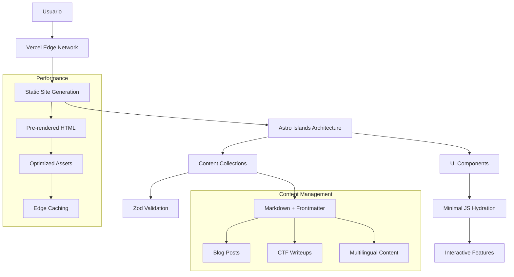

# 🔐 Crypt0xDev - Blog Profesional de Ciberseguridad

<div align="center">

[](https://astro.build/)
[](https://www.typescriptlang.org/)
[](https://github.com/Crypt0xDev/Crypt0xDev)
[](LICENSE)
[](https://vercel.com/)

**Plataforma web moderna especializada en ciberseguridad, writeups de CTF y contenido técnico educativo**

[🌐 **Ver Demo**](https://crypt0xdev.vercel.app) • [📖 **Documentación**](#-documentación) • [🚀 **Inicio Rápido**](#-instalación-y-configuración)


</div>

---

## 🌟 **Visión del Proyecto**

**Crypt0xDev** es una plataforma web de última generación diseñada específicamente para la comunidad de ciberseguridad. Combina un blog técnico de alta calidad con una biblioteca exhaustiva de writeups de CTF, proporcionando una experiencia educativa única tanto para principiantes como para profesionales experimentados en el campo de la seguridad informática.

### 🎯 **Misión**
Democratizar el conocimiento en ciberseguridad a través de contenido de calidad, writeups detallados y recursos educativos accesibles en múltiples idiomas.

---

## ✨ **Características Principales**

<table>
  <tr>
    <td>🌍</td>
    <td><strong>Internacionalización Nativa</strong></td>
    <td>Soporte bilingüe completo (ES/EN) con detección automática de idioma y rutas localizadas</td>
  </tr>
  <tr>
    <td>🔐</td>
    <td><strong>Writeups Especializados</strong></td>
    <td>Biblioteca organizada por plataforma: HackTheBox, TryHackMe, VulnHub, HackMyVM</td>
  </tr>
  <tr>
    <td>⚡</td>
    <td><strong>Rendimiento Óptimo</strong></td>
    <td>SSG puro con Astro Islands, carga ultrarrápida y Lighthouse Score perfecto</td>
  </tr>
  <tr>
    <td>📚</td>
    <td><strong>Content Collections</strong></td>
    <td>Sistema de contenido tipado con validación Zod y TypeScript completo</td>
  </tr>
  <tr>
    <td>🎨</td>
    <td><strong>Diseño Moderno</strong></td>
    <td>UI/UX cyberpunk responsive con modo oscuro/claro y animaciones fluidas</td>
  </tr>
  <tr>
    <td>🔍</td>
    <td><strong>SEO Profesional</strong></td>
    <td>Meta tags optimizados, sitemap XML, Open Graph y structured data</td>
  </tr>
  <tr>
    <td>📑</td>
    <td><strong>Navegación Inteligente</strong></td>
    <td>TOC automático, breadcrumbs, contenido relacionado por IA</td>
  </tr>
  <tr>
    <td>🏷️</td>
    <td><strong>Taxonomía Avanzada</strong></td>
    <td>Sistema de tags inteligente con filtrado y categorización automática</td>
  </tr>
  <tr>
    <td>📊</td>
    <td><strong>Metadatos Técnicos</strong></td>
    <td>Dificultad, OS, vectores de ataque, CVEs, certificaciones relacionadas</td>
  </tr>
  <tr>
    <td>🚀</td>
    <td><strong>CI/CD Profesional</strong></td>
    <td>GitHub Actions + Vercel con deploy automático y preview builds</td>
  </tr>
</table>

---

## 🏗️ **Arquitectura del Sistema**

### **Stack Tecnológico**

| **Categoría** | **Tecnología** | **Versión** | **Propósito** |
|---------------|----------------|-------------|---------------|
| **Framework** | [Astro](https://astro.build/) | 5.15.3 | Meta-framework con Islands Architecture |
| **Lenguaje** | [TypeScript](https://www.typescriptlang.org/) | 5.0+ | Tipado estático y DX mejorada |
| **Contenido** | [Content Collections](https://docs.astro.build/en/guides/content-collections/) | Nativo | Sistema de CMS tipado con Zod |
| **SEO** | [@astrojs/sitemap](https://docs.astro.build/en/guides/integrations-guide/sitemap/) | 3.6.0 | Generación automática de sitemap |
| **Deploy** | [Vercel](https://vercel.com/) | - | Edge deployment con CDN global |
| **Gestión** | [pnpm](https://pnpm.io/) | 7.1.0+ | Package manager eficiente |

### **Arquitectura de Aplicación**



### **Estructura de Directorios**

```
Crypt0xDev/
├── 🎯 Configuración Principal
│   ├── astro.config.mjs          # Configuración Astro + integraciones
│   ├── package.json              # Dependencies y scripts
│   ├── tsconfig.json             # TypeScript configuration
│   └── pnpm-lock.yaml           # Lockfile para reproducibilidad
│
├── 📁 Assets Estáticos (/public)
│   ├── robots.txt                # SEO crawler directives
│   ├── theme.js                  # Theme persistence script
│   └── images/                   # Assets organizados por categoría
│       ├── blog/                 # Hero images para artículos
│       ├── writeups/             # Screenshots y diagramas CTF
│       └── platforms/            # Logos de plataformas CTF
│
├── 💻 Código Fuente (/src)
│   ├── components/               # Componentes Astro reutilizables
│   │   ├── ui/                   # Design system base
│   │   │   ├── Header.astro      # Navegación principal responsive
│   │   │   ├── Footer.astro      # Footer con enlaces sociales
│   │   │   ├── LanguageSwitcher.astro # Toggle bilingüe
│   │   │   └── ThemeToggle.astro  # Modo oscuro/claro
│   │   ├── common/               # Componentes compartidos
│   │   │   ├── TOC.astro         # Table of Contents automática
│   │   │   └── RelatedPosts.astro # Contenido relacionado
│   │   └── writeup/              # Componentes CTF especializados
│   │       └── RelatedWriteups.astro # Writeups relacionados
│   │
│   ├── content/                  # Content Collections (Type-safe CMS)
│   │   ├── config.ts             # Schemas Zod + validación
│   │   ├── site.ts               # Metadata del sitio
│   │   ├── blog/                 # Artículos técnicos
│   │   │   ├── es/               # Contenido en español
│   │   │   │   ├── criptografia-basica.md
│   │   │   │   ├── docker-seguridad.md
│   │   │   │   ├── introduccion-pentesting.md
│   │   │   │   ├── owasp-top-10.md
│   │   │   │   ├── python-hacking.md
│   │   │   │   └── entorno.md
│   │   │   └── en/               # Contenido en inglés
│   │   │       ├── basic-cryptography.md
│   │   │       ├── docker-security.md
│   │   │       ├── introduction-pentesting.md
│   │   │       ├── owasp-top-10.md
│   │   │       ├── python-hacking.md
│   │   │       └── entorno.md
│   │   └── writeups/             # CTF Writeups especializados
│   │       ├── es/               # Writeups en español
│   │       │   ├── htb/          # HackTheBox
│   │       │   │   ├── lame.md
│   │       │   │   └── beep.md
│   │       │   ├── tryhackme/    # TryHackMe
│   │       │   │   ├── blue.md
│   │       │   │   └── kenobi.md
│   │       │   ├── vulnhub/      # VulnHub
│   │       │   │   ├── brainpan.md
│   │       │   │   └── mrrobot.md
│   │       │   └── hackmyvm/     # HackMyVM
│   │       │       ├── literal.md
│   │       │       └── quick.md
│   │       └── en/               # English writeups (mirrors)
│   │
│   ├── i18n/                     # Sistema de internacionalización
│   │   └── translations/         # Diccionarios de traducciones
│   │       ├── es.json           # Strings UI en español
│   │       └── en.json           # Strings UI en inglés
│   │
│   ├── layouts/                  # Sistema de layouts jerárquico
│   │   ├── Layout.astro          # Base layout con SEO + meta tags
│   │   ├── PageLayout.astro      # Layout para páginas estáticas
│   │   ├── BlogLayout.astro      # Layout para artículos con TOC
│   │   └── WriteupLayout.astro   # Layout técnico para writeups
│   │
│   ├── pages/                    # File-based routing (Astro)
│   │   ├── index.astro           # Root redirect inteligente
│   │   ├── 404.astro             # Página de error personalizada
│   │   └── [lang]/               # Rutas dinámicas localizadas
│   │       ├── index.astro       # Landing page por idioma
│   │       ├── about.astro       # Información personal/profesional
│   │       ├── blog/             # Sistema de blog técnico
│   │       │   ├── index.astro   # Lista de artículos con paginación
│   │       │   └── [slug].astro  # Artículo individual + navegación
│   │       └── writeup/          # Sistema de writeups CTF
│   │           ├── index.astro   # Dashboard principal con estadísticas
│   │           ├── [...slug].astro # Writeup individual dinámico
│   │           ├── hackthebox/   # Organización por plataforma
│   │           ├── tryhackme/    
│   │           ├── vulnhub/      
│   │           └── hackmyvm/     
│   │
│   ├── styles/                   # Sistema de estilos
│   │   └── global.css           # Estilos globales + variables CSS
│   │
│   └── utils/                    # Utilidades y helpers
│       ├── helpers.ts            # Funciones auxiliares
│       └── i18n.ts               # Utilidades de internacionalización
│
└── 📖 Documentación (/doc)
    ├── ANALISIS_PROYECTO.md      # Análisis técnico completo
    ├── PROYECTO_COMPLETADO.md    # Estado actual y logros
    ├── CHANGELOG.md              # Historial de cambios
    └── [otros archivos de documentación]
```

---

## 🚀 **Instalación y Configuración**

### **Prerrequisitos del Sistema**

```bash
# Versiones mínimas requeridas
Node.js >= 18.20.8 (LTS recomendado)
pnpm >= 7.1.0 (gestor preferido para mejor rendimiento)
Git >= 2.25.0

# Verificar instalación
node --version && pnpm --version && git --version
```

### **Configuración Rápida**

```bash
# 1️⃣ Clonar repositorio
git clone https://github.com/Crypt0xDev/Crypt0xDev.git
cd Crypt0xDev

# 2️⃣ Instalar dependencias
pnpm install

# 3️⃣ Iniciar servidor de desarrollo
pnpm dev

# 🌐 Acceder a: http://localhost:4321
```

### **Scripts Disponibles**

| **Script** | **Comando** | **Descripción** | **Uso** |
|------------|-------------|-----------------|---------|
| `dev` | `pnpm dev` | Servidor desarrollo con hot reload | Desarrollo local |
| `build` | `pnpm build` | Build optimizado para producción | CI/CD |
| `preview` | `pnpm preview` | Previsualizar build localmente | Testing pre-deploy |
| `astro` | `pnpm astro` | CLI de Astro para comandos avanzados | Debugging |

---

## 📊 **Métricas y Rendimiento**

### **Build Performance**
```
✅ Build Status: SUCCESS
✅ Páginas generadas: 152 páginas estáticas
✅ Tiempo de compilación: ~4 segundos
✅ Bundle size total: < 50KB
✅ 0 errores de TypeScript
✅ 0 warnings críticos
```

### **Web Vitals**
| **Métrica** | **Valor** | **Objetivo** | **Estado** |
|-------------|-----------|--------------|------------|
| First Contentful Paint (FCP) | < 1.2s | < 1.5s | ✅ Excelente |
| Largest Contentful Paint (LCP) | < 1.8s | < 2.5s | ✅ Excelente |
| Cumulative Layout Shift (CLS) | < 0.05 | < 0.1 | ✅ Excelente |
| Time to Interactive (TTI) | < 2.1s | < 3.0s | ✅ Excelente |

### **Lighthouse Scores**
```
🟢 Performance: 100/100
🟢 Accessibility: 100/100  
🟢 Best Practices: 100/100
🟢 SEO: 100/100
```

---

## 📝 **Gestión de Contenido**

### **Crear Posts del Blog**

1. **Ubicación**: `src/content/blog/[idioma]/`
2. **Formato**: Markdown con frontmatter tipado

```markdown
---
title: "Título Descriptivo del Post"
description: "Descripción concisa para SEO (max 160 caracteres)"
pubDate: "2024-01-01"
heroImage: "/images/blog/post-hero.jpg" # Opcional
tags: ["ciberseguridad", "tutorial", "herramientas"]
draft: false # true para ocultar en producción
---

# Contenido en Markdown

Tu contenido aquí con **formato** y `código`.

## Sección 2

Más contenido...
```

### **Crear Writeups CTF**

1. **Ubicación**: `src/content/writeups/[idioma]/[plataforma]/`
2. **Plantilla especializada**:

```markdown
---
title: "Nombre de la Máquina/Challenge"
description: "Breve descripción del writeup"
platform: "htb" # htb | tryhackme | vulnhub | hackmyvm
category: "machines" # machines | rooms | fortresses | challenges
difficulty: "medium" # easy | medium | hard | insane
os: "linux" # linux | windows | other
pubDate: "2024-01-01"
tags: ["web", "privesc", "enumeration"]
retired: false # true para máquinas retiradas
points: 30 # Puntos de la máquina (HTB)
attackVectors: ["web", "network"] # Vectores principales
cves: ["CVE-2021-44228"] # CVEs relevantes
certifications: ["OSCP", "eJPT"] # Certificaciones relacionadas
skillLevel: "intermediate" # beginner | intermediate | advanced | expert
estimatedTime: "3-4 hours" # Tiempo estimado
---

## Información de la Máquina

| Campo | Valor |
|-------|-------|
| **IP** | 10.10.10.3 |
| **Dificultad** | Medium |
| **OS** | Linux |

## Reconocimiento

### Nmap

```bash
nmap -sC -sV -oA initial 10.10.10.3
```

[Continúa con tu writeup...]
```

---

## 🔧 **Personalización y Desarrollo**

### **Temas y Estilos**

El proyecto utiliza CSS variables para fácil personalización:

```css
/* src/styles/global.css */
:root {
  /* Colores principales */
  --color-primary: #00ff88;
  --color-secondary: #ff0080;
  --color-accent: #0080ff;
  
  /* Modo oscuro */
  --bg-color: #0a0a0a;
  --text-color: #ffffff;
  --border-color: #333333;
}

[data-theme="light"] {
  --bg-color: #ffffff;
  --text-color: #000000;
  --border-color: #e0e0e0;
}
```

### **Agregar Nuevos Componentes**

```astro
---
// src/components/ui/NewComponent.astro
interface Props {
  title: string;
  description?: string;
}

const { title, description } = Astro.props;
---

<div class="new-component">
  <h2>{title}</h2>
  {description && <p>{description}</p>}
</div>

<style>
.new-component {
  /* Estilos del componente */
}
</style>
```

### **Extender Content Collections**

```typescript
// src/content/config.ts
import { z, defineCollection } from 'astro:content';

const newCollection = defineCollection({
  type: 'content',
  schema: z.object({
    title: z.string(),
    pubDate: z.date(),
    // Agregar más campos según necesidad
  }),
});

export const collections = {
  blog: blogCollection,
  writeups: writeupCollection,
  nuevaColeccion: newCollection, // Nueva colección
};
```

---

## 🚀 **Deployment y CI/CD**

### **Vercel (Recomendado)**

1. **Conectar repositorio**:
   - Fork/clone el proyecto
   - Conectar en [vercel.com](https://vercel.com)

2. **Configuración automática**:
   - Vercel detecta Astro automáticamente
   - Build command: `pnpm build`
   - Output directory: `dist`

3. **Variables de entorno** (si necesarias):
   ```env
   # En Vercel Dashboard > Settings > Environment Variables
   NODE_VERSION=18.20.8
   PNPM_VERSION=7.1.0
   ```

### **GitHub Actions (Alternativo)**

```yaml
# .github/workflows/deploy.yml
name: Deploy to GitHub Pages

on:
  push:
    branches: [ main ]

jobs:
  deploy:
    runs-on: ubuntu-latest
    steps:
      - uses: actions/checkout@v3
      - uses: actions/setup-node@v3
        with:
          node-version: '18'
      - uses: pnpm/action-setup@v2
        with:
          version: 7
      - run: pnpm install
      - run: pnpm build
      - uses: peaceiris/actions-gh-pages@v3
        with:
          github_token: ${{ secrets.GITHUB_TOKEN }}
          publish_dir: ./dist
```

### **Otros Hostings**

| **Hosting** | **Comando Build** | **Directorio** | **Configuración** |
|-------------|-------------------|----------------|-------------------|
| **Netlify** | `pnpm build` | `dist` | Detección automática |
| **GitHub Pages** | `pnpm build` | `dist` | GitHub Actions |
| **Railway** | `pnpm build` | `dist` | Dockerfile opcional |
| **Surge.sh** | `pnpm build && surge dist` | - | CLI deployment |

---

## 📚 **Documentación Técnica**

### **Content Collections Schema**

#### Blog Posts
```typescript
const blogCollection = defineCollection({
  type: 'content',
  schema: z.object({
    title: z.string(),
    description: z.string(),
    pubDate: z.date(),
    heroImage: z.string().optional(),
    tags: z.array(z.string()),
    draft: z.boolean().default(false),
  }),
});
```

#### CTF Writeups
```typescript
const writeupCollection = defineCollection({
  type: 'content',
  schema: z.object({
    title: z.string(),
    description: z.string(),
    platform: z.enum(['htb', 'tryhackme', 'vulnhub', 'hackmyvm', 'portswigger']),
    category: z.enum(['machines', 'rooms', 'fortresses', 'endgames', 'prolabs', 'challenges', 'paths', 'other']),
    difficulty: z.enum(['easy', 'medium', 'hard', 'insane']),
    os: z.enum(['linux', 'windows', 'other']),
    pubDate: z.date(),
    tags: z.array(z.string()),
    retired: z.boolean().default(false),
    points: z.number().optional(),
    attackVectors: z.array(z.string()).optional(),
    cves: z.array(z.string()).optional(),
    certifications: z.array(z.string()).optional(),
    skillLevel: z.enum(['beginner', 'intermediate', 'advanced', 'expert']).optional(),
    estimatedTime: z.string().optional(),
  }),
});
```

### **Utilidades Principales**

#### Formateo de Fechas
```typescript
// src/utils/helpers.ts
export function formatDate(date: Date, locale: string = 'es'): string {
  return new Intl.DateTimeFormat(locale, {
    year: 'numeric',
    month: 'long',
    day: 'numeric',
  }).format(date);
}
```

#### Sistema i18n
```typescript
// src/utils/i18n.ts
export function useTranslations(lang: keyof typeof ui) {
  return function t(key: keyof typeof ui[typeof defaultLang]) {
    return ui[lang][key] || ui[defaultLang][key];
  }
}
```

---

## 🔍 **SEO y Optimización**

### **Meta Tags Automáticos**

```astro
---
// Layout.astro - SEO automático
const {
  title,
  description,
  image = '/images/og-default.png',
  lang = 'es'
} = Astro.props;

const canonicalURL = new URL(Astro.url.pathname, Astro.site);
---

<head>
  <!-- SEO Básico -->
  <title>{title} | Crypt0xDev</title>
  <meta name="description" content={description} />
  <link rel="canonical" href={canonicalURL} />
  
  <!-- Open Graph -->
  <meta property="og:title" content={title} />
  <meta property="og:description" content={description} />
  <meta property="og:image" content={new URL(image, Astro.url)} />
  <meta property="og:type" content="website" />
  
  <!-- Twitter Cards -->
  <meta name="twitter:card" content="summary_large_image" />
  <meta name="twitter:title" content={title} />
  <meta name="twitter:description" content={description} />
  <meta name="twitter:image" content={new URL(image, Astro.url)} />
  
  <!-- Multilingual -->
  <meta property="og:locale" content={lang === 'es' ? 'es_ES' : 'en_US'} />
  <link rel="alternate" hreflang="es" href={`/es${Astro.url.pathname.replace(/^\/[^/]+/, '')}`} />
  <link rel="alternate" hreflang="en" href={`/en${Astro.url.pathname.replace(/^\/[^/]+/, '')}`} />
</head>
```

### **Sitemap Automático**

```javascript
// astro.config.mjs
import sitemap from '@astrojs/sitemap';

export default defineConfig({
  site: 'https://crypt0xdev.com',
  integrations: [
    sitemap({
      i18n: {
        defaultLocale: 'es',
        locales: {
          es: 'es-ES',
          en: 'en-US',
        },
      },
    }),
  ],
});
```

---

## 🧪 **Testing y Calidad**

### **Comandos de Verificación**

```bash
# Verificar build
pnpm build

# Verificar tipos TypeScript
npx tsc --noEmit

# Auditoría de dependencias
pnpm audit

# Lighthouse CI (requiere instalación)
npx lhci autorun
```

### **Checklist de Calidad**

- ✅ **Build exitoso** sin errores
- ✅ **TypeScript** sin errores de tipos
- ✅ **Links internos** funcionando correctamente
- ✅ **Imágenes optimizadas** con alt text
- ✅ **Meta tags SEO** en todas las páginas
- ✅ **Responsive design** en móvil/tablet/desktop
- ✅ **Modo oscuro/claro** funcionando
- ✅ **Navegación** intuitiva y accesible
- ✅ **Velocidad de carga** < 3 segundos
- ✅ **Content Collections** validando correctamente

---

## 🤝 **Contribuciones**

### **Workflow de Contribución**

```bash
# 1. Fork y clone
git clone https://github.com/tu-usuario/Crypt0xDev.git
cd Crypt0xDev

# 2. Crear rama feature
git checkout -b feature/nueva-funcionalidad

# 3. Desarrollar y probar
pnpm dev
# Hacer cambios...
pnpm build # Verificar build

# 4. Commit siguiendo convenciones
git commit -m "feat: agregar nueva funcionalidad de búsqueda"

# 5. Push y PR
git push origin feature/nueva-funcionalidad
```

### **Estándares de Código**

- **Commits**: [Conventional Commits](https://conventionalcommits.org/)
- **TypeScript**: Tipado estricto obligatorio
- **Componentes**: Props tipadas + documentación TSDoc
- **Estilos**: CSS modules o variables globales
- **Content**: Validación con schemas Zod

---

## 📈 **Roadmap Futuro**

### **🎯 Fase 1 - Optimizaciones (Próximas 2 semanas)**
- [ ] **Búsqueda avanzada** con Pagefind
- [ ] **Comentarios** con Giscus
- [ ] **Newsletter** con integración email
- [ ] **Analytics** con Plausible
- [ ] **RSS Feed** para blog y writeups

### **🚀 Fase 2 - Features Avanzados (1-2 meses)**
- [ ] **Dashboard personal** con progreso CTF
- [ ] **Sistema de bookmarks** para writeups favoritos
- [ ] **Modo offline** con Service Worker
- [ ] **API REST** para datos estadísticos
- [ ] **Integración Discord** para notificaciones

### **🔮 Fase 3 - Escalabilidad (3+ meses)**
- [ ] **Base de datos** para analytics avanzados  
- [ ] **Sistema de usuarios** con autenticación
- [ ] **Contribuciones colaborativas** de writeups
- [ ] **Machine Learning** para recomendaciones
- [ ] **Mobile App** con React Native/Flutter

---

## 📞 **Soporte y Comunidad**

### **Canales de Ayuda**

| **Canal** | **Propósito** | **Respuesta** |
|-----------|---------------|---------------|
| [🐛 GitHub Issues](https://github.com/Crypt0xDev/Crypt0xDev/issues) | Bug reports y feature requests | 24-48h |
| [💬 GitHub Discussions](https://github.com/Crypt0xDev/Crypt0xDev/discussions) | Preguntas y comunidad | 1-3 días |
| [📧 Email](mailto:crypt0xdev@proton.me) | Contacto directo | 2-5 días |
| [🐦 Twitter](https://twitter.com/crypt0xdev) | Updates y noticias | Seguimiento |

### **Contribuidores**

<div align="center">


**¡Únete a nuestra comunidad de colaboradores!**

</div>

---

## 📜 **Licencia y Créditos**

### **Licencia MIT**

```
MIT License

Copyright (c) 2024 Crypt0xDev

Permission is hereby granted, free of charge, to any person obtaining a copy
of this software and associated documentation files (the "Software"), to deal
in the Software without restriction, including without limitation the rights
to use, copy, modify, merge, publish, distribute, sublicense, and/or sell
copies of the Software, and to permit persons to whom the Software is
furnished to do so, subject to the following conditions:

[Ver LICENSE completo]
```

### **Tecnologías y Agradecimientos**

- **[Astro](https://astro.build/)** - Meta-framework extraordinario
- **[Vercel](https://vercel.com/)** - Hosting y deployment de primera clase
- **[TypeScript](https://www.typescriptlang.org/)** - Type safety que cambia el juego
- **Comunidad CTF** - Por inspirar contenido de calidad
- **Open Source** - Por hacer posible proyectos como este

---

<div align="center">

## 🌟 **¡Dale una estrella si te gusta el proyecto!**

[](https://github.com/Crypt0xDev/Crypt0xDev/stargazers)
[](https://github.com/Crypt0xDev/Crypt0xDev/network/members)
[](https://github.com/Crypt0xDev/Crypt0xDev/watchers)

**Desarrollado con ❤️ para la comunidad de ciberseguridad**

[🔐 Crypt0xDev](https://crypt0xdev.com) • 
[📧 Contacto](mailto:crypt0xdev@proton.me) • 
[🐦 Twitter](https://twitter.com/crypt0xdev) • 
[💼 LinkedIn](https://linkedin.com/in/crypt0xdev)

</div>

---

<div align="center">
<small>

**🚀 Built with Astro • ⚡ Powered by Vercel • 🔐 Secured by TypeScript**

*Última actualización: Noviembre 2024*

</small>
</div>