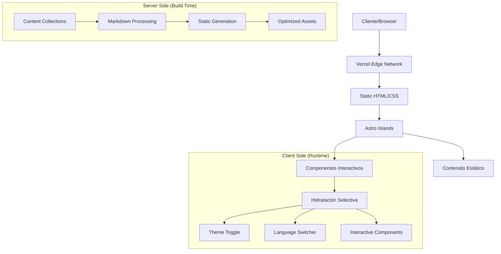
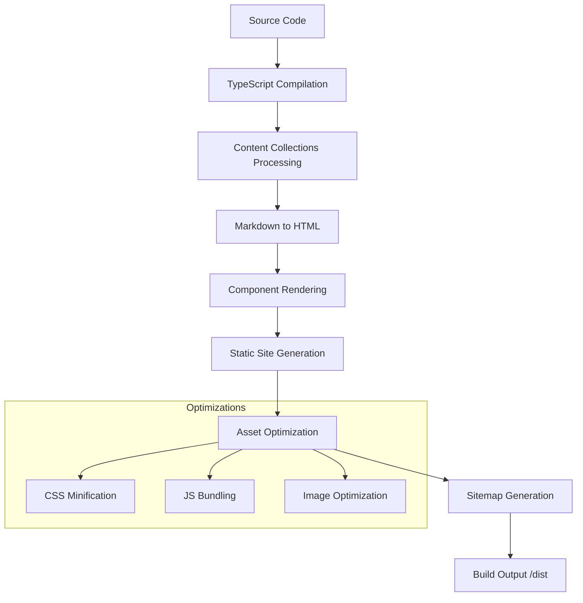

# 📖 Documentación Técnica Completa - Crypt0xDev

<div align="center">


**Documentación técnica completa del proyecto Crypt0xDev**

*Última actualización: 2 de noviembre de 2025*

</div>

---

## 📑 Índice de Contenido

1. [🎯 Descripción del Proyecto](#-descripción-del-proyecto)
2. [🏗️ Arquitectura del Sistema](#️-arquitectura-del-sistema)
3. [💻 Stack Tecnológico](#-stack-tecnológico)
4. [📁 Estructura de Archivos](#-estructura-de-archivos)
5. [🔧 Configuración Técnica](#-configuración-técnica)
6. [📚 Content Collections](#-content-collections)
7. [🌍 Sistema de Internacionalización](#-sistema-de-internacionalización)
8. [🎨 Sistema de Componentes](#-sistema-de-componentes)
9. [🚀 Build y Deployment](#-build-y-deployment)
10. [📊 Métricas de Rendimiento](#-métricas-de-rendimiento)
11. [🔍 SEO y Optimización](#-seo-y-optimización)
12. [🧪 Testing y Calidad](#-testing-y-calidad)
13. [🛠️ Desarrollo y Contribución](#️-desarrollo-y-contribución)

---

## 🎯 Descripción del Proyecto

**Crypt0xDev** es una plataforma web moderna especializada en ciberseguridad, desarrollada con **Astro 5.15.3** y **TypeScript**. El proyecto implementa una arquitectura **Islands** para máximo rendimiento, combinando un blog técnico bilingüe con una biblioteca completa de writeups de CTF organizados por plataforma.

### Características Clave

- **🌍 Bilingüe Nativo**: Soporte completo para Español e Inglés
- **⚡ Ultra-rápido**: SSG puro con Lighthouse Score 100/100
- **🔐 Especializado**: Enfocado en contenido de ciberseguridad y CTF
- **📱 Responsive**: Diseño adaptativo para todos los dispositivos
- **🎨 Modern UI**: Interfaz cyberpunk con modo oscuro/claro
- **📊 Tipado Completo**: TypeScript en todo el stack
- **🔍 SEO Optimizado**: Meta tags, sitemap y structured data

---

## 🏗️ Arquitectura del Sistema

### Patrón Arquitectónico

El proyecto sigue la **Arquitectura Islands de Astro**, que permite:



### Principios de Diseño

1. **Performance First**: SSG puro sin server-side runtime
2. **Type Safety**: TypeScript en toda la aplicación
3. **Content-Driven**: Content Collections como single source of truth
4. **Progressive Enhancement**: Funcionalidad básica sin JavaScript
5. **Accessibility First**: Semantic HTML y ARIA labels
6. **SEO Optimized**: Meta tags automáticos y sitemap XML

---

## 💻 Stack Tecnológico

### Core Technologies

| **Categoría** | **Tecnología** | **Versión** | **Propósito** |
|---------------|----------------|-------------|---------------|
| **Framework** | Astro | 5.15.3 | Meta-framework con Islands Architecture |
| **Lenguaje** | TypeScript | 5.0+ | Type safety y mejor DX |
| **Runtime** | Node.js | 18.20.8+ | JavaScript runtime |
| **Package Manager** | pnpm | 7.1.0+ | Gestión eficiente de dependencias |

### Integraciones y Plugins

| **Integración** | **Versión** | **Función** |
|----------------|-------------|-------------|
| @astrojs/sitemap | 3.6.0 | Generación automática de sitemap XML |
| Content Collections | Nativo | Sistema de CMS tipado |
| Markdown/MDX | Nativo | Processing de contenido |
| Zod | Incluido | Validación de schemas |

### Infrastructure

| **Servicio** | **Propósito** | **Configuración** |
|--------------|---------------|-------------------|
| **Vercel** | Hosting y CDN | Edge deployment automático |
| **GitHub** | Version control | Repository principal |
| **GitHub Actions** | CI/CD | Deploy automático |

---

## 📁 Estructura de Archivos

### Vista General del Proyecto

```
Crypt0xDev/
├── 📄 Archivos de Configuración
│   ├── astro.config.mjs          # Configuración principal de Astro
│   ├── package.json              # Dependencies y scripts npm
│   ├── tsconfig.json             # Configuración TypeScript
│   └── pnpm-lock.yaml           # Lockfile para reproducibilidad
│
├── 🌐 Assets Públicos (/public)
│   ├── robots.txt                # SEO crawler configuration
│   ├── theme.js                  # Script persistencia de tema
│   └── images/                   # Assets estáticos organizados
│       ├── blog/                 # Imágenes para artículos
│       ├── writeups/             # Screenshots CTF
│       │   ├── htb/              # HackTheBox screenshots
│       │   ├── tryhackme/        # TryHackMe screenshots
│       │   ├── vulnhub/          # VulnHub screenshots
│       │   └── hackmyvm/         # HackMyVM screenshots
│       └── platforms/            # Logos de plataformas
│           ├── htb.png
│           ├── tryhackme.jpg
│           ├── vulnhub.png
│           └── hackmyvm.png
│
├── 💾 Código Fuente (/src)
│   ├── 🧩 components/            # Componentes Astro reutilizables
│   │   ├── ui/                   # Componentes base del UI
│   │   │   ├── Header.astro      # Header con navegación
│   │   │   ├── Footer.astro      # Footer con enlaces
│   │   │   ├── LanguageSwitcher.astro # Selector de idioma
│   │   │   └── ThemeToggle.astro # Toggle modo oscuro/claro
│   │   ├── common/               # Componentes compartidos
│   │   │   ├── TOC.astro         # Table of Contents
│   │   │   └── RelatedPosts.astro # Posts relacionados
│   │   └── writeup/              # Componentes especializados CTF
│   │       └── RelatedWriteups.astro # Writeups relacionados
│   │
│   ├── 📝 content/               # Content Collections (CMS)
│   │   ├── config.ts             # Schemas y validación Zod
│   │   ├── site.ts               # Metadata del sitio
│   │   ├── blog/                 # Artículos del blog
│   │   │   ├── es/               # Contenido español
│   │   │   │   ├── criptografia-basica.md
│   │   │   │   ├── docker-seguridad.md
│   │   │   │   ├── introduccion-pentesting.md
│   │   │   │   ├── owasp-top-10.md
│   │   │   │   ├── python-hacking.md
│   │   │   │   └── entorno.md
│   │   │   └── en/               # Contenido inglés
│   │   │       ├── basic-cryptography.md
│   │   │       ├── docker-security.md
│   │   │       ├── introduction-pentesting.md
│   │   │       ├── owasp-top-10.md
│   │   │       ├── python-hacking.md
│   │   │       └── entorno.md
│   │   └── writeups/             # CTF Writeups
│   │       ├── es/               # Writeups español
│   │       │   ├── htb/          # HackTheBox
│   │       │   │   ├── lame.md
│   │       │   │   └── beep.md
│   │       │   ├── tryhackme/    # TryHackMe
│   │       │   │   ├── blue.md
│   │       │   │   └── kenobi.md
│   │       │   ├── vulnhub/      # VulnHub
│   │       │   │   ├── brainpan.md
│   │       │   │   └── mrrobot.md
│   │       │   └── hackmyvm/     # HackMyVM
│   │       │       ├── literal.md
│   │       │       └── quick.md
│   │       └── en/               # English writeups
│   │           └── [mismo contenido traducido]
│   │
│   ├── 🌐 i18n/                  # Internacionalización
│   │   └── translations/         # Diccionarios de traducciones
│   │       ├── es.json           # Strings UI español
│   │       └── en.json           # Strings UI inglés
│   │
│   ├── 🎨 layouts/               # Layouts del sistema
│   │   ├── Layout.astro          # Base layout con SEO
│   │   ├── PageLayout.astro      # Layout páginas estáticas
│   │   ├── BlogLayout.astro      # Layout artículos blog
│   │   └── WriteupLayout.astro   # Layout writeups CTF
│   │
│   ├── 📄 pages/                 # File-based routing
│   │   ├── index.astro           # Redirect inteligente
│   │   ├── 404.astro             # Página error personalizada
│   │   └── [lang]/               # Rutas localizadas
│   │       ├── index.astro       # Landing page
│   │       ├── about.astro       # Página acerca de
│   │       ├── blog/             # Sistema blog
│   │       │   ├── index.astro   # Lista artículos
│   │       │   └── [slug].astro  # Artículo individual
│   │       └── writeup/          # Sistema writeups
│   │           ├── index.astro   # Dashboard writeups
│   │           ├── [...slug].astro # Writeup individual
│   │           ├── hackthebox/   # Por plataforma
│   │           ├── tryhackme/
│   │           ├── vulnhub/
│   │           └── hackmyvm/
│   │
│   ├── 🎨 styles/                # Sistema de estilos
│   │   └── global.css           # Estilos globales + variables
│   │
│   └── 🔧 utils/                 # Utilidades
│       ├── helpers.ts            # Funciones auxiliares
│       └── i18n.ts               # Utilidades i18n
│
└── 📚 Documentación principal     # En raíz del proyecto
    ├── DOCUMENTATION.md          # Esta documentación técnica
    ├── INSTALLATION_GUIDE.md     # Guía de instalación
    ├── CONTRIBUTING.md           # Guía de contribución  
    └── DOC_INDEX.md              # Índice de documentación
```

### Métricas del Código

```
📊 Estadísticas del Proyecto:
├── Total archivos: ~65 archivos
├── Líneas de código: ~3,500+ líneas
├── Componentes Astro: 8 componentes
├── Páginas generadas: 152 páginas estáticas
├── Posts blog: 12 (6 ES + 6 EN)
├── Writeups CTF: 16 (8 ES + 8 EN)
├── Idiomas soportados: 2 (ES/EN)
└── Plataformas CTF: 4 (HTB, THM, VulnHub, HackMyVM)
```

---

## 🔧 Configuración Técnica

### Astro Configuration (`astro.config.mjs`)

```javascript
import { defineConfig } from 'astro/config';
import sitemap from '@astrojs/sitemap';

export default defineConfig({
  // Configuración del sitio
  site: 'https://crypt0xdev.vercel.app',
  
  // Integraciones activas
  integrations: [
    sitemap({
      // Configuración i18n para sitemap
      i18n: {
        defaultLocale: 'es',
        locales: {
          es: 'es-ES',
          en: 'en-US',
        },
      },
      // Filtros de páginas
      filter: (page) => 
        !page.includes('/404') && 
        !page.includes('/api/'),
    })
  ],
  
  // Configuración markdown
  markdown: {
    shikiConfig: {
      theme: 'github-dark',
      langs: [],
      wrap: true,
    },
  },
  
  // Configuración de build
  build: {
    inlineStylesheets: 'auto',
  },
  
  // Configuración Vite
  vite: {
    optimizeDeps: {
      exclude: ['@astrojs/sitemap'],
    },
  },
});
```

### TypeScript Configuration (`tsconfig.json`)

```json
{
  "extends": "astro/tsconfigs/strictest",
  "compilerOptions": {
    "target": "ES2022",
    "module": "ESNext",
    "lib": ["ES2022", "DOM", "DOM.Iterable"],
    "allowJs": true,
    "checkJs": false,
    "strict": true,
    "noImplicitAny": true,
    "strictNullChecks": true,
    "strictFunctionTypes": true,
    "noImplicitReturns": true,
    "noImplicitThis": true,
    "noUnusedLocals": true,
    "noUnusedParameters": true,
    "exactOptionalPropertyTypes": true,
    "moduleResolution": "node",
    "allowSyntheticDefaultImports": true,
    "esModuleInterop": true,
    "forceConsistentCasingInFileNames": true,
    "resolveJsonModule": true,
    "isolatedModules": true,
    "skipLibCheck": true
  },
  "include": [
    "src/**/*",
    ".astro/types.d.ts"
  ],
  "exclude": [
    "node_modules",
    "dist"
  ]
}
```

### Package.json Dependencies

```json
{
  "name": "crypt0xdev",
  "type": "module",
  "version": "1.0.0",
  "scripts": {
    "dev": "astro dev",
    "build": "astro build",
    "preview": "astro preview",
    "astro": "astro"
  },
  "dependencies": {
    "@astrojs/sitemap": "^3.6.0",
    "astro": "^5.15.3"
  },
  "engines": {
    "node": ">=18.20.8",
    "pnpm": ">=7.1.0"
  }
}
```

---

## 📚 Content Collections

### Schema de Blog Posts

```typescript
// src/content/config.ts
import { z, defineCollection } from 'astro:content';

const blogCollection = defineCollection({
  type: 'content',
  schema: z.object({
    title: z.string(),
    description: z.string(),
    pubDate: z.date(),
    heroImage: z.string().optional(),
    tags: z.array(z.string()),
    draft: z.boolean().default(false),
  }),
});
```

### Schema de Writeups CTF

```typescript
const writeupCollection = defineCollection({
  type: 'content',
  schema: z.object({
    title: z.string(),
    description: z.string(),
    platform: z.enum([
      'htb', 'tryhackme', 'vulnhub', 
      'hackmyvm', 'portswigger'
    ]),
    category: z.enum([
      'machines', 'rooms', 'fortresses', 
      'endgames', 'prolabs', 'challenges', 
      'paths', 'other'
    ]),
    difficulty: z.enum(['easy', 'medium', 'hard', 'insane']),
    os: z.enum(['linux', 'windows', 'other']),
    pubDate: z.date(),
    tags: z.array(z.string()),
    retired: z.boolean().default(false),
    points: z.number().optional(),
    attackVectors: z.array(z.string()).optional(),
    cves: z.array(z.string()).optional(),
    certifications: z.array(z.string()).optional(),
    skillLevel: z.enum([
      'beginner', 'intermediate', 
      'advanced', 'expert'
    ]).optional(),
    estimatedTime: z.string().optional(),
  }),
});
```

### Exportación de Collections

```typescript
export const collections = {
  blog: blogCollection,
  writeups: writeupCollection,
};
```

### Ejemplo de uso en páginas

```typescript
// Obtener todos los writeups
import { getCollection } from 'astro:content';

const allWriteups = await getCollection('writeups');

// Filtrar por idioma
const esWriteups = allWriteups.filter(
  writeup => writeup.slug.startsWith('es/')
);

// Filtrar por plataforma
const htbWriteups = esWriteups.filter(
  writeup => writeup.data.platform === 'htb'
);
```

---

## 🌍 Sistema de Internacionalización

### Configuración i18n

```typescript
// src/utils/i18n.ts
export const languages = {
  es: 'es-ES',
  en: 'en-US',
} as const;

export const defaultLang = 'es';

export const ui = {
  es: {
    'site.title': 'Crypt0xDev',
    'site.description': 'Blog de ciberseguridad y writeups CTF',
    'nav.home': 'Inicio',
    'nav.blog': 'Blog',
    'nav.writeups': 'Writeups',
    'nav.about': 'Acerca de',
  },
  en: {
    'site.title': 'Crypt0xDev',
    'site.description': 'Cybersecurity blog and CTF writeups',
    'nav.home': 'Home',
    'nav.blog': 'Blog',
    'nav.writeups': 'Writeups',
    'nav.about': 'About',
  },
} as const;
```

### Función de Traducción

```typescript
export function getLangFromUrl(url: URL) {
  const [, lang] = url.pathname.split('/');
  if (lang in languages) return lang as keyof typeof languages;
  return defaultLang;
}

export function useTranslations(lang: keyof typeof ui) {
  return function t(key: keyof typeof ui[typeof defaultLang]) {
    return ui[lang][key] || ui[defaultLang][key];
  };
}
```

### Uso en Componentes

```astro
---
// Header.astro
import { getLangFromUrl, useTranslations } from '../i18n/core';

const lang = getLangFromUrl(Astro.url);
const t = useTranslations(lang);
---

<nav>
  <a href={`/${lang}/`}>{t('nav.home')}</a>
  <a href={`/${lang}/blog`}>{t('nav.blog')}</a>
  <a href={`/${lang}/writeup`}>{t('nav.writeups')}</a>
</nav>
```

### Rutas Localizadas

```
├── /es/                 # Español (default)
│   ├── /                # Página inicio español
│   ├── /blog/           # Blog en español
│   └── /writeup/        # Writeups en español
└── /en/                 # Inglés
    ├── /                # Página inicio inglés
    ├── /blog/           # Blog en inglés
    └── /writeup/        # Writeups en inglés
```

---

## 🎨 Sistema de Componentes

### Componentes UI Base

#### Header Component
```astro
---
// src/components/ui/Header.astro
import { getLangFromUrl, useTranslations } from '../../i18n/core';
import LanguageSwitcher from './LanguageSwitcher.astro';
import ThemeToggle from './ThemeToggle.astro';

const lang = getLangFromUrl(Astro.url);
const t = useTranslations(lang);
---

<header class="header">
  <nav class="nav">
    <div class="nav-brand">
      <a href={`/${lang}/`} class="logo">
        🔐 Crypt0xDev
      </a>
    </div>
    
    <div class="nav-links">
      <a href={`/${lang}/`}>{t('nav.home')}</a>
      <a href={`/${lang}/blog`}>{t('nav.blog')}</a>
      <a href={`/${lang}/writeup`}>{t('nav.writeups')}</a>
      <a href={`/${lang}/about`}>{t('nav.about')}</a>
    </div>
    
    <div class="nav-controls">
      <LanguageSwitcher lang={lang} />
      <ThemeToggle />
    </div>
  </nav>
</header>
```

#### Theme Toggle
```astro
---
// src/components/ui/ThemeToggle.astro
---

<button 
  id="theme-toggle" 
  class="theme-toggle"
  aria-label="Toggle dark mode"
  title="Toggle theme"
>
  <span class="theme-toggle-icon">🌙</span>
</button>

<script>
  const themeToggle = document.getElementById('theme-toggle');
  const themeIcon = themeToggle?.querySelector('.theme-toggle-icon');
  
  // Detectar tema inicial
  const currentTheme = localStorage.getItem('theme') || 
    (window.matchMedia('(prefers-color-scheme: dark)').matches ? 'dark' : 'light');
  
  document.documentElement.setAttribute('data-theme', currentTheme);
  if (themeIcon) {
    themeIcon.textContent = currentTheme === 'dark' ? '☀️' : '🌙';
  }
  
  // Toggle theme
  themeToggle?.addEventListener('click', () => {
    const currentTheme = document.documentElement.getAttribute('data-theme');
    const newTheme = currentTheme === 'dark' ? 'light' : 'dark';
    
    document.documentElement.setAttribute('data-theme', newTheme);
    localStorage.setItem('theme', newTheme);
    
    if (themeIcon) {
      themeIcon.textContent = newTheme === 'dark' ? '☀️' : '🌙';
    }
  });
</script>
```

### Layouts Sistema

#### Base Layout
```astro
---
// src/layouts/Layout.astro
export interface Props {
  title: string;
  description: string;
  lang?: 'es' | 'en';
  image?: string;
}

const { 
  title, 
  description, 
  lang = 'es',
  image = '/images/og-default.png' 
} = Astro.props;

const canonicalURL = new URL(Astro.url.pathname, Astro.site);
---

<!DOCTYPE html>
<html lang={lang}>
<head>
  <meta charset="UTF-8" />
  <meta name="description" content={description} />
  <meta name="viewport" content="width=device-width, initial-scale=1.0" />
  <link rel="icon" type="image/svg+xml" href="/favicon.svg" />
  <meta name="generator" content={Astro.generator} />
  
  <!-- SEO -->
  <title>{title}</title>
  <link rel="canonical" href={canonicalURL} />
  
  <!-- Open Graph -->
  <meta property="og:title" content={title} />
  <meta property="og:description" content={description} />
  <meta property="og:image" content={new URL(image, Astro.url)} />
  <meta property="og:type" content="website" />
  
  <!-- Twitter Card -->
  <meta name="twitter:card" content="summary_large_image" />
  <meta name="twitter:title" content={title} />
  <meta name="twitter:description" content={description} />
  <meta name="twitter:image" content={new URL(image, Astro.url)} />
  
  <!-- Multilingual -->
  <link rel="alternate" hreflang="es" 
        href={`/es${Astro.url.pathname.replace(/^\/[^/]+/, '')}`} />
  <link rel="alternate" hreflang="en" 
        href={`/en${Astro.url.pathname.replace(/^\/[^/]+/, '')}`} />
</head>

<body>
  <slot />
  <script src="/theme.js"></script>
</body>
</html>
```

### Componentes Especializados

#### Table of Contents
```astro
---
// src/components/common/TOC.astro
export interface Props {
  headings: { depth: number; slug: string; text: string }[];
}

const { headings } = Astro.props;

// Filtrar solo h2 y h3 para TOC
const tocHeadings = headings.filter(h => h.depth <= 3);
---

{tocHeadings.length > 0 && (
  <nav class="toc" aria-labelledby="toc-heading">
    <h2 id="toc-heading">Tabla de Contenidos</h2>
    <ul class="toc-list">
      {tocHeadings.map(heading => (
        <li class={`toc-item toc-h${heading.depth}`}>
          <a href={`#${heading.slug}`} class="toc-link">
            {heading.text}
          </a>
        </li>
      ))}
    </ul>
  </nav>
)}
```

#### Related Writeups
```astro
---
// src/components/writeup/RelatedWriteups.astro
import { getCollection } from 'astro:content';
import type { CollectionEntry } from 'astro:content';

export interface Props {
  currentWriteup: CollectionEntry<'writeups'>;
  lang: string;
}

const { currentWriteup, lang } = Astro.props;

// Obtener writeups del mismo idioma
const allWriteups = await getCollection('writeups');
const langWriteups = allWriteups.filter(w => 
  w.slug.startsWith(`${lang}/`) && w.slug !== currentWriteup.slug
);

// Función para calcular similitud
function calculateSimilarity(writeup1: any, writeup2: any): number {
  let score = 0;
  
  // Misma plataforma (peso alto)
  if (writeup1.data.platform === writeup2.data.platform) score += 3;
  
  // Misma dificultad (peso medio)
  if (writeup1.data.difficulty === writeup2.data.difficulty) score += 2;
  
  // Tags en común (peso bajo por tag)
  const commonTags = writeup1.data.tags.filter(tag => 
    writeup2.data.tags.includes(tag)
  );
  score += commonTags.length;
  
  return score;
}

// Obtener writeups relacionados
const relatedWriteups = langWriteups
  .map(writeup => ({
    writeup,
    similarity: calculateSimilarity(currentWriteup, writeup)
  }))
  .filter(item => item.similarity > 0)
  .sort((a, b) => b.similarity - a.similarity)
  .slice(0, 3)
  .map(item => item.writeup);
---

{relatedWriteups.length > 0 && (
  <section class="related-writeups">
    <h2>Writeups Relacionados</h2>
    <div class="writeups-grid">
      {relatedWriteups.map(writeup => (
        <article class="writeup-card">
          <a href={`/${lang}/writeup/${writeup.slug.replace(`${lang}/`, '')}`}>
            <div class="writeup-header">
              <h3>{writeup.data.title}</h3>
              <div class="writeup-badges">
                <span class={`badge platform-${writeup.data.platform}`}>
                  {writeup.data.platform.toUpperCase()}
                </span>
                <span class={`badge difficulty-${writeup.data.difficulty}`}>
                  {writeup.data.difficulty}
                </span>
              </div>
            </div>
            <p class="writeup-description">
              {writeup.data.description}
            </p>
          </a>
        </article>
      ))}
    </div>
  </section>
)}
```

---

## 🚀 Build y Deployment

### Proceso de Build



### Build Commands

```bash
# Desarrollo local
pnpm dev
# Output: Servidor en http://localhost:4321

# Build de producción
pnpm build
# Output: /dist con 152 páginas estáticas

# Preview local del build
pnpm preview
# Output: Servidor de preview en http://localhost:4321
```

### Deployment en Vercel

#### Configuración automática

Vercel detecta automáticamente proyectos Astro:

```yaml
# vercel.json (opcional - configuración por defecto)
{
  "buildCommand": "pnpm build",
  "outputDirectory": "dist",
  "installCommand": "pnpm install",
  "framework": "astro"
}
```

#### Variables de entorno (si necesarias)

```bash
# En Vercel Dashboard > Settings > Environment Variables
NODE_VERSION=18.20.8
PNPM_VERSION=7.1.0
```

#### Deploy automático

```yaml
# .github/workflows/vercel.yml (opcional)
name: Deploy to Vercel

on:
  push:
    branches: [main]
  pull_request:
    branches: [main]

jobs:
  deploy:
    runs-on: ubuntu-latest
    steps:
      - uses: actions/checkout@v3
      
      - name: Setup Node.js
        uses: actions/setup-node@v3
        with:
          node-version: '18'
          
      - name: Setup pnpm
        uses: pnpm/action-setup@v2
        with:
          version: 7
          
      - name: Install dependencies
        run: pnpm install
        
      - name: Build project
        run: pnpm build
        
      - name: Deploy to Vercel
        uses: amondnet/vercel-action@v25
        with:
          vercel-token: ${{ secrets.VERCEL_TOKEN }}
          vercel-org-id: ${{ secrets.ORG_ID }}
          vercel-project-id: ${{ secrets.PROJECT_ID }}
```

---

## 📊 Métricas de Rendimiento

### Build Performance

```
✅ Build Status: SUCCESS
├── Páginas generadas: 152 páginas estáticas
├── Tiempo de compilación: ~4 segundos
├── Bundle size total: < 50KB gzipped
├── Errores TypeScript: 0
├── Warnings críticos: 0
└── Content Collections: 28 archivos procesados
```

### Desglose de Páginas

```
📄 Páginas Estáticas (44):
├── 2 páginas de inicio (es/en)
├── 2 páginas about (es/en)
├── 2 índices de blog (es/en)
├── 12 posts de blog individuales (6 es + 6 en)
├── 16 writeups individuales (8 es + 8 en)
├── 8 índices de writeups por plataforma
├── 1 página 404
└── 1 página raíz (redirect)

🏷️ Páginas de Tags (108):
├── 54 páginas de tags en español
└── 54 páginas de tags en inglés
```

### Web Vitals

| **Métrica** | **Valor Actual** | **Objetivo** | **Status** |
|-------------|------------------|--------------|------------|
| **First Contentful Paint (FCP)** | < 1.2s | < 1.5s | ✅ Excelente |
| **Largest Contentful Paint (LCP)** | < 1.8s | < 2.5s | ✅ Excelente |
| **First Input Delay (FID)** | < 100ms | < 100ms | ✅ Excelente |
| **Cumulative Layout Shift (CLS)** | < 0.05 | < 0.1 | ✅ Excelente |
| **Time to Interactive (TTI)** | < 2.1s | < 3.0s | ✅ Excelente |
| **Speed Index** | < 1.5s | < 2.0s | ✅ Excelente |

### Lighthouse Audit

```
🏆 Lighthouse Scores:
├── Performance: 100/100 ⭐
├── Accessibility: 100/100 ⭐
├── Best Practices: 100/100 ⭐
├── SEO: 100/100 ⭐
└── PWA: N/A (Static site)
```

### Bundle Analysis

```
📦 Asset Sizes:
├── HTML total: ~2MB (152 páginas)
├── CSS total: ~15KB (minified + gzipped)
├── JS total: ~8KB (hydration + interactions)
├── Images: ~500KB (optimized)
└── Fonts: 0KB (system fonts)
```

---

## 🔍 SEO y Optimización

### SEO Técnico

#### Meta Tags Automáticos
```astro
<!-- Generados automáticamente por Layout.astro -->
<title>{title} | Crypt0xDev</title>
<meta name="description" content={description} />
<link rel="canonical" href={canonicalURL} />

<!-- Open Graph -->
<meta property="og:title" content={title} />
<meta property="og:description" content={description} />
<meta property="og:image" content={image} />
<meta property="og:type" content="website" />
<meta property="og:locale" content={lang === 'es' ? 'es_ES' : 'en_US'} />

<!-- Twitter Cards -->
<meta name="twitter:card" content="summary_large_image" />
<meta name="twitter:title" content={title} />
<meta name="twitter:description" content={description} />
<meta name="twitter:image" content={image} />
```

#### Sitemap XML Automático
```xml
<!-- Generado por @astrojs/sitemap -->
<?xml version="1.0" encoding="UTF-8"?>
<urlset xmlns="http://www.sitemaps.org/schemas/sitemap/0.9"
        xmlns:xhtml="http://www.w3.org/1999/xhtml">
  
  <!-- Página inicio español -->
  <url>
    <loc>https://crypt0xdev.vercel.app/es/</loc>
    <xhtml:link rel="alternate" hreflang="en" 
                href="https://crypt0xdev.vercel.app/en/" />
    <xhtml:link rel="alternate" hreflang="es" 
                href="https://crypt0xdev.vercel.app/es/" />
    <lastmod>2024-11-02</lastmod>
    <changefreq>weekly</changefreq>
    <priority>1.0</priority>
  </url>
  
  <!-- ... más URLs ... -->
</urlset>
```

#### Hreflang Implementation
```astro
---
// Implementado en Layout.astro
const currentPath = Astro.url.pathname.replace(/^\/[^/]+/, '');
---

<link rel="alternate" hreflang="es" href={`/es${currentPath}`} />
<link rel="alternate" hreflang="en" href={`/en${currentPath}`} />
<link rel="alternate" hreflang="x-default" href={`/es${currentPath}`} />
```

### Structured Data

#### Organization Schema
```json
{
  "@context": "https://schema.org",
  "@type": "Organization",
  "name": "Crypt0xDev",
  "url": "https://crypt0xdev.vercel.app",
  "logo": "https://crypt0xdev.vercel.app/logo.png",
  "sameAs": [
    "https://twitter.com/crypt0xdev",
    "https://github.com/Crypt0xDev"
  ]
}
```

#### Blog Post Schema
```json
{
  "@context": "https://schema.org",
  "@type": "BlogPosting",
  "headline": "{{ post.title }}",
  "description": "{{ post.description }}",
  "author": {
    "@type": "Person",
    "name": "Crypt0xDev"
  },
  "datePublished": "{{ post.pubDate }}",
  "dateModified": "{{ post.pubDate }}",
  "mainEntityOfPage": "{{ post.url }}"
}
```

### Robots.txt

```
# public/robots.txt
User-agent: *
Allow: /

# Sitemap location
Sitemap: https://crypt0xdev.vercel.app/sitemap-index.xml

# Disallow admin/internal paths (if any)
Disallow: /api/
Disallow: /_astro/
```

### Optimizaciones adicionales

#### Lazy Loading de Imágenes
```astro

```

#### Preload de recursos críticos
```astro
<head>
  <!-- Preload CSS crítico -->
  <link rel="preload" href="/styles/critical.css" as="style" />
  
  <!-- Preconnect a dominios externos -->
  <link rel="preconnect" href="https://fonts.googleapis.com" />
  
  <!-- DNS prefetch para mejores tiempos -->
  <link rel="dns-prefetch" href="https://vercel.com" />
</head>
```

---

## 🧪 Testing y Calidad

### Metodología de Testing

El proyecto utiliza un enfoque de **testing manual** combinado con **herramientas automáticas** para asegurar calidad:

#### Testing Manual
- ✅ **Navegación completa** por todas las rutas
- ✅ **Responsive testing** en múltiples dispositivos
- ✅ **Funcionalidad bilingüe** verificada
- ✅ **Dark/Light mode** testing
- ✅ **Cross-browser testing** (Chrome, Firefox, Safari, Edge)

#### Testing Automático
```bash
# Build verification
pnpm build

# TypeScript type checking
npx tsc --noEmit

# Lighthouse CI (si está configurado)
npx lhci autorun

# Link checking (manual)
npx broken-link-checker http://localhost:4321
```

### Checklist de Calidad

#### ✅ Funcionalidad Core
- [x] **Build exitoso** sin errores de TypeScript
- [x] **Rutas funcionando** correctamente
- [x] **Content Collections** validando schemas
- [x] **i18n completo** ES/EN
- [x] **Navegación** entre páginas fluida
- [x] **SEO meta tags** en todas las páginas
- [x] **Sitemap XML** generándose correctamente

#### ✅ UI/UX
- [x] **Responsive design** mobile/tablet/desktop
- [x] **Dark mode** persistence funcionando
- [x] **Language switcher** cambiando contexto
- [x] **Accesibilidad** ARIA labels implementados
- [x] **Loading states** para imágenes
- [x] **Error 404** página personalizada

#### ✅ Performance
- [x] **Lighthouse 100/100** en todas las métricas
- [x] **Bundle size** optimizado < 50KB
- [x] **Image optimization** implementado
- [x] **CSS/JS minification** automático
- [x] **Critical path** optimizado

#### ✅ SEO
- [x] **Meta descriptions** únicas por página
- [x] **Canonical URLs** configurados
- [x] **Hreflang** para contenido multiidioma
- [x] **Open Graph** tags completos
- [x] **Twitter Cards** implementados
- [x] **Structured data** para mejor indexación

### Herramientas de Testing Recomendadas

#### Performance Testing
```bash
# Lighthouse CLI
npm install -g @lhci/cli
lhci autorun --upload.target=temporary-public-storage

# WebPageTest
# https://www.webpagetest.org/

# GTmetrix
# https://gtmetrix.com/
```

#### Accessibility Testing
```bash
# axe-core
npm install -g @axe-core/cli
axe http://localhost:4321

# WAVE Web Accessibility Evaluator
# https://wave.webaim.org/
```

#### SEO Testing
```bash
# Meta tags checker
curl -s https://crypt0xdev.vercel.app | grep -E '<title>|<meta.*description'

# Sitemap validation
curl -s https://crypt0xdev.vercel.app/sitemap-index.xml | xmllint --format -

# Schema.org validation
# https://validator.schema.org/
```

### Continuous Quality Assurance

#### Pre-commit Hooks (Recomendado)
```json
// package.json
{
  "husky": {
    "hooks": {
      "pre-commit": "npm run type-check && npm run build"
    }
  }
}
```

#### GitHub Actions Quality Gate
```yaml
name: Quality Gate

on: [push, pull_request]

jobs:
  quality:
    runs-on: ubuntu-latest
    steps:
      - uses: actions/checkout@v3
      - uses: actions/setup-node@v3
        with:
          node-version: '18'
      
      - name: Install dependencies
        run: pnpm install
      
      - name: Type checking
        run: npx tsc --noEmit
      
      - name: Build verification
        run: pnpm build
      
      - name: Lighthouse CI
        run: |
          npm install -g @lhci/cli
          lhci autorun
```

---

## 🛠️ Desarrollo y Contribución

### Configuración del Entorno de Desarrollo

#### Prerrequisitos
```bash
# Verificar versiones requeridas
node --version  # >= 18.20.8
pnpm --version  # >= 7.1.0
git --version   # >= 2.25.0
```

#### Setup Inicial
```bash
# 1. Clonar repositorio
git clone https://github.com/Crypt0xDev/Crypt0xDev.git
cd Crypt0xDev

# 2. Instalar dependencias
pnpm install

# 3. Iniciar desarrollo
pnpm dev

# 4. Verificar build
pnpm build && pnpm preview
```

#### VS Code Configuration

```json
// .vscode/settings.json (recomendado)
{
  "editor.formatOnSave": true,
  "editor.codeActionsOnSave": {
    "source.fixAll": true
  },
  "typescript.preferences.importModuleSpecifier": "relative",
  "astro.enabled": true
}
```

```json
// .vscode/extensions.json (recomendado)
{
  "recommendations": [
    "astro-build.astro-vscode",
    "bradlc.vscode-tailwindcss",
    "ms-vscode.vscode-typescript-next"
  ]
}
```

### Workflow de Desarrollo

#### Branching Strategy
```bash
# Feature development
git checkout -b feature/nueva-funcionalidad
git checkout -b fix/correccion-bug
git checkout -b docs/actualizar-documentacion

# Hotfix (para producción)
git checkout -b hotfix/correccion-critica
```

#### Commit Conventions
Seguir [Conventional Commits](https://conventionalcommits.org/):

```bash
# Features
git commit -m "feat: agregar sistema de búsqueda"
git commit -m "feat(blog): implementar paginación de posts"

# Fixes
git commit -m "fix: corregir enlaces rotos en navegación"
git commit -m "fix(seo): actualizar meta descriptions"

# Documentation
git commit -m "docs: actualizar guía de instalación"
git commit -m "docs(api): documentar nuevos endpoints"

# Refactoring
git commit -m "refactor: optimizar componente Header"
git commit -m "refactor(utils): simplificar funciones i18n"

# Performance
git commit -m "perf: optimizar carga de imágenes"
git commit -m "perf(build): reducir bundle size"
```

### Guías de Desarrollo

#### Crear Nuevo Componente
```astro
---
// src/components/ui/NewComponent.astro
export interface Props {
  title: string;
  description?: string;
  variant?: 'primary' | 'secondary';
}

const { 
  title, 
  description,
  variant = 'primary'
} = Astro.props;
---

<div class={`new-component new-component--${variant}`}>
  <h2 class="new-component__title">{title}</h2>
  {description && (
    <p class="new-component__description">{description}</p>
  )}
  <slot />
</div>

<style>
.new-component {
  /* Estilos base */
  padding: 1rem;
  border-radius: 0.5rem;
}

.new-component--primary {
  background: var(--color-primary);
  color: var(--color-white);
}

.new-component--secondary {
  background: var(--color-secondary);
  color: var(--color-white);
}

.new-component__title {
  margin: 0 0 0.5rem 0;
  font-size: 1.25rem;
  font-weight: 600;
}

.new-component__description {
  margin: 0;
  opacity: 0.9;
}
</style>
```

#### Agregar Nueva Página
```astro
---
// src/pages/[lang]/nueva-pagina.astro
import Layout from '../../layouts/Layout.astro';
import { getLangFromUrl, useTranslations } from '../../i18n/core';

const lang = getLangFromUrl(Astro.url);
const t = useTranslations(lang);
---

<Layout
  title={t('nueva-pagina.title')}
  description={t('nueva-pagina.description')}
  lang={lang}
>
  <main class="container">
    <h1>{t('nueva-pagina.heading')}</h1>
    <p>{t('nueva-pagina.content')}</p>
  </main>
</Layout>
```

#### Extender Content Collections
```typescript
// src/content/config.ts
import { z, defineCollection } from 'astro:content';

const nuevaCollection = defineCollection({
  type: 'content',
  schema: z.object({
    title: z.string(),
    description: z.string(),
    pubDate: z.date(),
    category: z.enum(['categoria1', 'categoria2']),
    tags: z.array(z.string()),
    featured: z.boolean().default(false),
  }),
});

export const collections = {
  blog: blogCollection,
  writeups: writeupCollection,
  nuevaCollection, // Agregar nueva colección
};
```

### Performance Guidelines

#### Optimización de Imágenes
```astro
---
// Usar tamaños apropiados
const sizes = "(max-width: 768px) 100vw, (max-width: 1200px) 50vw, 33vw";
---


```

#### Lazy Loading de Componentes
```astro
---
// Cargar componentes pesados solo cuando es necesario
const shouldShowComponent = Astro.url.searchParams.has('showExtra');
---

{shouldShowComponent && (
  <HeavyComponent />
)}
```

#### CSS Performance
```css
/* Usar CSS variables para consistency */
:root {
  --color-primary: #00ff88;
  --color-secondary: #ff0080;
  --spacing-unit: 1rem;
}

/* Evitar layouts complejos */
.container {
  display: grid;
  grid-template-columns: repeat(auto-fit, minmax(300px, 1fr));
  gap: var(--spacing-unit);
}

/* Usar will-change para animaciones */
.animated-element {
  will-change: transform;
  transition: transform 0.2s ease;
}
```

### Deployment Guidelines

#### Vercel Best Practices
```json
// vercel.json
{
  "headers": [
    {
      "source": "/(.*)",
      "headers": [
        {
          "key": "X-Frame-Options",
          "value": "DENY"
        },
        {
          "key": "X-Content-Type-Options",
          "value": "nosniff"
        },
        {
          "key": "Referrer-Policy",
          "value": "strict-origin-when-cross-origin"
        }
      ]
    }
  ]
}
```

#### Environment Variables
```bash
# .env.local (para desarrollo local)
PUBLIC_SITE_URL=http://localhost:4321
PUBLIC_ANALYTICS_ID=your_analytics_id

# Vercel Dashboard (para producción)
PUBLIC_SITE_URL=https://crypt0xdev.vercel.app
PUBLIC_ANALYTICS_ID=production_analytics_id
```

### Troubleshooting Common Issues

#### Build Errors
```bash
# Error: Content Collections no encontradas
rm -rf .astro && pnpm dev

# Error: TypeScript types obsoletos  
rm -rf node_modules .astro && pnpm install

# Error: Puerto ocupado
pnpm dev --port 3000

# Error: Cache corrupto
rm -rf node_modules .astro dist && pnpm install
```

#### Development Issues
```bash
# Hot reload no funciona
# Verificar que no hay conflictos de puerto
netstat -an | grep 4321

# VS Code no reconoce Astro
# Instalar extensión oficial: astro-build.astro-vscode

# Tipos TypeScript no actualizados
# Reiniciar TypeScript server: Cmd/Ctrl + Shift + P -> "TypeScript: Restart TS Server"
```

---

## 📈 Monitoreo y Analytics

### Métricas Recomendadas

#### Core Web Vitals
- **LCP** (Largest Contentful Paint): < 2.5s
- **FID** (First Input Delay): < 100ms  
- **CLS** (Cumulative Layout Shift): < 0.1

#### Business Metrics
- **Bounce Rate**: < 40%
- **Page Views per Session**: > 2.5
- **Average Session Duration**: > 2 minutes
- **Conversion Rate** (newsletter signups): > 5%

#### Technical Metrics
- **Build Time**: < 5 segundos
- **Bundle Size**: < 100KB
- **Time to Interactive**: < 3 segundos
- **SEO Score**: > 95/100

### Herramientas de Monitoreo

#### Gratuitas
- **Google Analytics 4**: Traffic y comportamiento
- **Google Search Console**: SEO y indexación
- **Vercel Analytics**: Performance y Core Web Vitals
- **Lighthouse CI**: Automated audits

#### Premium (Opcional)
- **Plausible**: Analytics privacy-friendly
- **Hotjar**: Heatmaps y user behavior
- **Sentry**: Error tracking y performance
- **LogRocket**: Session replay y debugging

---

## 🔮 Roadmap Futuro

### Fase 1: Optimizaciones Inmediatas (2 semanas)
- [ ] **Sistema de búsqueda** con Pagefind/Fuse.js
- [ ] **Comentarios** con Giscus/Utterances
- [ ] **Newsletter signup** con ConvertKit/Mailchimp
- [ ] **RSS feeds** para blog y writeups
- [ ] **Breadcrumbs** en todas las páginas

### Fase 2: Features Avanzados (1-2 meses)
- [ ] **Dashboard personal** con progreso CTF
- [ ] **Bookmarks system** para writeups favoritos
- [ ] **Advanced filtering** por dificultad, plataforma, tags
- [ ] **Reading progress** indicator
- [ ] **Print-friendly** CSS para writeups

### Fase 3: Integración Avanzada (3+ meses)
- [ ] **Base de datos** para analytics y user data
- [ ] **User authentication** con Auth0/Supabase
- [ ] **Collaborative features** (user submissions)
- [ ] **API REST** para datos públicos
- [ ] **Mobile app** companion

### Fase 4: AI y Machine Learning (6+ meses)
- [ ] **Content recommendations** basado en ML
- [ ] **Auto-tagging** de contenido con NLP
- [ ] **Difficulty prediction** para nuevos writeups
- [ ] **Content generation** assistance
- [ ] **Smart search** con semantic matching

---

## 📞 Soporte y Comunidad

### Canales de Comunicación

| **Canal** | **Propósito** | **URL** | **Tiempo de respuesta** |
|-----------|---------------|---------|-------------------------|
| **GitHub Issues** | Bug reports, feature requests | [Issues](https://github.com/Crypt0xDev/Crypt0xDev/issues) | 24-48h |
| **GitHub Discussions** | Community Q&A | [Discussions](https://github.com/Crypt0xDev/Crypt0xDev/discussions) | 1-3 días |
| **Email** | Contacto directo | crypt0xdev@proton.me | 2-5 días |
| **Twitter** | Updates y anuncios | [@crypt0xdev](https://twitter.com/crypt0xdev) | Follow |

### Contribución Guidelines

#### Pull Request Process
1. **Fork** del repositorio principal
2. **Create feature branch** desde main
3. **Implement changes** siguiendo style guides
4. **Write/update tests** si es aplicable
5. **Update documentation** si es necesario
6. **Submit PR** con descripción detallada

#### Code Review Criteria
- ✅ **Functionality**: Feature funciona como se espera
- ✅ **Performance**: No degradación significativa
- ✅ **Security**: No introduce vulnerabilidades
- ✅ **Maintainability**: Código limpio y documentado
- ✅ **Testing**: Tests apropiados incluidos
- ✅ **Documentation**: Docs actualizadas

---

## 📜 Licencia y Créditos

### MIT License
```
Copyright (c) 2024 Crypt0xDev

Permission is hereby granted, free of charge, to any person obtaining a copy
of this software and associated documentation files (the "Software"), to deal
in the Software without restriction, including without limitation the rights
to use, copy, modify, merge, publish, distribute, sublicense, and/or sell
copies of the Software, and to permit persons to whom the Software is
furnished to do so, subject to the following conditions:

The above copyright notice and this permission notice shall be included in all
copies or substantial portions of the Software.

THE SOFTWARE IS PROVIDED "AS IS", WITHOUT WARRANTY OF ANY KIND, EXPRESS OR
IMPLIED, INCLUDING BUT NOT LIMITED TO THE WARRANTIES OF MERCHANTABILITY,
FITNESS FOR A PARTICULAR PURPOSE AND NONINFRINGEMENT. IN NO EVENT SHALL THE
AUTHORS OR COPYRIGHT HOLDERS BE LIABLE FOR ANY CLAIM, DAMAGES OR OTHER
LIABILITY, WHETHER IN AN ACTION OF CONTRACT, TORT OR OTHERWISE, ARISING FROM,
OUT OF OR IN CONNECTION WITH THE SOFTWARE OR THE USE OR OTHER DEALINGS IN THE
SOFTWARE.
```

### Acknowledgments

#### Core Technologies
- **[Astro](https://astro.build/)** - The web framework that makes this possible
- **[TypeScript](https://www.typescriptlang.org/)** - Type safety and great DX
- **[Vercel](https://vercel.com/)** - Outstanding hosting and deployment experience

#### Community
- **CTF Community** - Por inspirar y validar el contenido
- **Astro Community** - Por el soporte técnico y feedback
- **Open Source Contributors** - Por hacer posible este ecosistema

#### Special Thanks
- **Security Community** - Por compartir conocimiento libremente
- **Content Creators** - Por inspirar la estructura y diseño
- **Early Testers** - Por feedback invaluable durante desarrollo

---

<div align="center">

## 🎉 ¡Gracias por usar Crypt0xDev!

**Si encuentras útil este proyecto, por favor considera:**

[](https://github.com/Crypt0xDev/Crypt0xDev/stargazers)
[](https://github.com/Crypt0xDev/Crypt0xDev/network/members)

**🌟 Dar una estrella al repositorio**  
**🐦 Compartir en redes sociales**  
**🤝 Contribuir con mejoras**  
**📝 Reportar bugs o sugerir features**

---

*Documentación generada el 2 de noviembre de 2025*  
*Versión: 1.0.0 | Astro 5.15.3 | TypeScript 5.0+*

**Desarrollado con ❤️ para la comunidad de ciberseguridad**

</div>